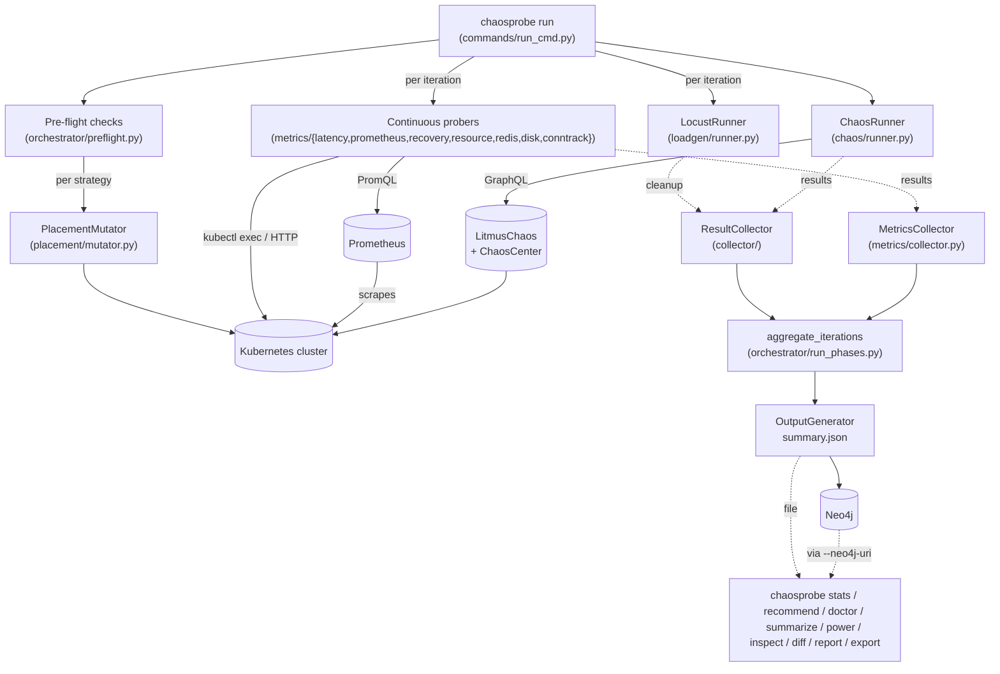

# ChaosProbe Technical Reference

> **Where this fits.** In the [Diátaxis](https://diataxis.fr/) terms used by the
> [documentation map](docs/index.md), this document is the consolidated
> **reference + explanation** appendix: a single, citable, deep technical
> write-up. For learning-oriented and task-oriented docs (tutorial, how-to
> guides) start at [docs/index.md](docs/index.md). The quick CLI lookup lives in
> [docs/reference/cli.md](docs/reference/cli.md).

## 1. System Overview

ChaosProbe is a Python framework for automated Kubernetes chaos testing with AI-consumable output. It wraps LitmusChaos to run ChaosEngine experiments via the ChaosCenter GraphQL API, collects real-time pod recovery metrics, and stores all data in a Neo4j graph database for machine-learning feedback loops.

**Core loop**: deploy manifests → run chaos experiments → collect metrics → store in Neo4j → AI reads data, edits manifests, re-runs, compares.

### Data flow during a run



The chaos runner, the load generator, and every continuous prober run **in parallel** during each iteration's chaos window. `MetricsCollector` joins their outputs after the chaos ends; `aggregate_iterations` rolls per-iteration data into the per-strategy summary that downstream tools consume.

### Layout (legacy)

```
ChaosProbe CLI
      │
      ├── cli.py (~282 lines, thin shell)
      │     status, provision, compare, cleanup + command registrations
      │
      ├── commands/  (10 extracted command modules)
      │     run_cmd, init_cmd, delete_cmd, graph_cmd, visualize_cmd,
      │     placement_cmd, cluster_cmd, dashboard_cmd, probe_cmd, shared
      │
      ├── Cluster Manager (provisioner/setup.py, ~1056 lines)
      │     LitmusSetup inherits: _VagrantMixin, _ComponentsMixin,
      │     _ChaosCenterAPIMixin, _ChaosCenterMixin
      │     ├── Vagrant (local dev: multi-node KVM/libvirt cluster)
      │     ├── Kubespray (production bare-metal/cloud)
      │     ├── Installs Helm, LitmusChaos, ChaosCenter, RBAC,
      │     │   metrics-server, Prometheus, Neo4j
      │     └── ChaosCenter API/GraphQL (chaoscenter_api.py)
      │
      ├── Config Loader (config/loader.py)
      │     ├── Validator (config/validator.py)
      │     └── Topology Parser (config/topology.py)
      │
      ├── Infrastructure Provisioner (provisioner/kubernetes.py)
      │
      ├── Placement Engine
      │     ├── Strategy (placement/strategy.py)
      │     └── Mutator (placement/mutator.py)
      │
      ├── Chaos Runner (chaos/runner.py)
      │     ChaosCenter GraphQL: save → trigger → poll experiments
      │
      ├── Load Generator (loadgen/runner.py)
      │     Locust-based: steady (50u), ramp (100u), spike (200u)
      │
      ├── Metrics Collection
      │     ├── RecoveryWatcher (metrics/recovery.py)
      │     ├── ContinuousProberBase (metrics/base.py)
      │     ├── Latency, Throughput, Resources, Prometheus, Conntrack probers
      │     ├── AnomalyLabels, Cascade, Remediation, TimeSeries
      │     └── MetricsCollector (metrics/collector.py)
      │
      ├── Result Collector (collector/result_collector.py)
      │
      ├── Orchestrator
      │     ├── strategy_runner.py — RunContext + execute_strategy()
      │     ├── run_phases.py — preflight, graph init, result writing
      │     ├── preflight.py — pre-iteration scenario/cluster checks
      │     ├── probers.py — create/start/stop continuous probers
      │     ├── portforward.py — kubectl port-forward lifecycle
      │     ├── timeout.py — probe-timeout and chaos-duration arithmetic
      │     ├── readiness.py — target-pod, app-ready, warmup gates
      │     ├── recovery.py — K8s API recovery + control-plane SSH remediation
      │     └── diagnostics.py — captures cluster state for Unknown probe verdicts
      │
      ├── Output
      │     ├── generator.py — structured JSON output (schema v2.0.0)
      │     ├── comparison.py — before/after run comparison
      │     ├── visualize.py + charts.py — charts, HTML reports
      │     └── ml_export.py — CSV/Parquet ML datasets
      │
      ├── Storage — Neo4j Graph Store (primary)
      │     ├── neo4j_store.py — thin shell (Writer + Reader mixins)
      │     ├── neo4j_writer.py — all write operations
      │     └── neo4j_reader.py — all read operations
      │
      └── Graph Analysis (graph/analysis.py)
            blast radius, topology comparison, colocation impact,
            critical path, strategy summary
```

---

## 2. Module Reference

### 2.1 Configuration (`config/`)

#### loader.py

Loads scenario directories or single YAML files. Auto-classifies resources by `kind`: `ChaosEngine` kinds go to `experiments`, everything else to `manifests`.

| Function | Signature | Purpose |
|---|---|---|
| `load_scenario` | `(scenario_path: str) -> Dict` | Returns `{path, manifests, experiments, namespace, cluster?, probes?}` |
| `_load_yaml_file` | `(filepath: Path) -> Tuple[List, List]` | Parses multi-document YAML, classifies by kind |
| `_load_yaml_directory` | `(dirpath: Path) -> Tuple[List, List]` | Loads all .yaml/.yml from directory |
| `_detect_namespace` | `(experiments: List) -> str` | Extracts namespace from ChaosEngine appinfo (default: `"default"`) |
| `_load_cluster_config` | `(dirpath: Path) -> Optional[Dict]` | Loads `cluster.yaml` if present |
| `_detect_rust_probes` | `(dirpath: Path) -> List` | Discovers Rust cmdProbe sources in `probes/` subdirectory |

**Constant**: `CHAOS_KINDS = {"ChaosEngine"}`

#### topology.py

Extracts service-to-service dependencies from Kubernetes Deployment manifests by parsing environment variables (`*_SERVICE_ADDR`, `*_ADDR`, `*_SERVICE_HOST`).

| Function | Signature | Purpose |
|---|---|---|
| `parse_topology_from_scenario` | `(scenario: Dict) -> List[ServiceRoute]` | Extracts routes from a loaded scenario dict |
| `parse_topology_from_directory` | `(deploy_dir: str) -> List[ServiceRoute]` | Loads all YAML files and extracts routes |
| `parse_topology_from_manifests` | `(manifests: List[Dict]) -> List[ServiceRoute]` | Extracts routes from parsed manifest dicts |

**Type**: `ServiceRoute = Tuple[str, str, str, str, str]` — `(source_service, target_service, target_host, protocol, description)`

#### validator.py

Validates scenarios for structural correctness before execution. Validates all LitmusChaos probe types.

| Function | Purpose |
|---|---|
| `validate_scenario(scenario)` | Validates entire scenario. Raises `ValidationError` with aggregated errors |
| `_validate_chaos_engine(spec, filepath)` | Checks apiVersion, kind, experiments, applabel, chaosServiceAccount, probes |
| `_validate_probe(probe, filepath, exp_name)` | Validates probe name, type, mode, runProperties, type-specific inputs |
| `_validate_manifest(spec, filepath)` | Checks apiVersion, kind, metadata.name |
| `_validate_cluster_config(cluster)` | Checks provider (vagrant/kubespray), workers config |

**Supported probe types**: `httpProbe`, `cmdProbe`, `k8sProbe`, `promProbe`
**Supported probe modes**: `SOT`, `EOT`, `Edge`, `Continuous`, `OnChaos`

---

### 2.2 Chaos Execution (`chaos/`)

#### runner.py

Runs experiments via the ChaosCenter GraphQL API. Each ChaosEngine spec is wrapped in an Argo Workflow, saved via `saveChaosExperiment`, triggered via `runChaosExperiment`, and polled via `getExperimentRun`.

**Class: `ChaosRunner(namespace, timeout=300, chaoscenter=None)`**

| Method | Purpose |
|---|---|
| `run_experiments(experiments)` | Saves, triggers, and polls experiments via ChaosCenter |
| `get_executed_experiments()` | Returns metadata for all executed experiments |

**`chaoscenter` dict** (keys: `token`, `project_id`, `infra_id`, `gql_url`): Required for ChaosCenter API integration.

**Terminal phases**: `Completed`, `Completed_With_Error`, `Completed_With_Probe_Failure`, `Stopped`, `Error`, `Timeout`, `Terminated`, `Skipped`.

---

### 2.3 Result Collection (`collector/`)

#### result_collector.py

Collects ChaosResult CRDs and calculates resilience metrics. Supports all LitmusChaos probe types with type-aware parsing.

**Class: `ResultCollector(namespace)`**

| Method | Purpose |
|---|---|
| `collect(executed_experiments)` | Collects results for all executed experiments |

**Module function**: `calculate_resilience_score(results, weights=None) -> float` — weighted average of probe success percentages (0-100).

**Probe type normalisation**: `HTTPProbe` → `httpProbe`, `CmdProbe` → `cmdProbe`, `K8sProbe` → `k8sProbe`, `PromProbe` → `promProbe`.

---

### 2.4 Metrics Collection (`metrics/`)

#### base.py — ContinuousProberBase

Abstract base for all continuous probers. Manages background thread lifecycle, phase tracking (PreChaos/DuringChaos/PostChaos), and aggregation.

Subclasses: `ContinuousLatencyProber`, `ContinuousRedisProber`, `ContinuousDiskProber`, `ContinuousResourceProber`, `ContinuousPrometheusProber`, `ConntrackProtocolProber`.

**Used-nodes-only aggregation**: `ContinuousResourceProber` aggregates node-level CPU and memory metrics only across nodes that host pods in the target namespace. This prevents idle nodes from diluting placement-specific signals (e.g., `colocate` concentrates all pods on one node — averaging across all cluster nodes would hide the actual resource pressure on that node).

**Helpers**: `find_ready_pod()` finds a ready pod by `app=` label. `find_probe_pod()` auto-discovers any pod with a shell (and optionally python3) in the namespace — no hardcoded service preferences. `pod_has_shell()` verifies shell access via `kubectl exec`.

#### recovery.py — RecoveryWatcher

**Class: `RecoveryWatcher(namespace, deployment_name)`**

Background thread using the Kubernetes watch API to observe pod lifecycle events in real-time. Records deletion and ready timestamps as they happen.

| Method | Purpose |
|---|---|
| `start()` | Snapshots current pods, starts background watch thread |
| `stop()` | Stops watch, finalizes any pending recovery cycle |
| `result()` | Returns structured recovery data with cycles and summary |

**Recovery cycle**: DELETED → PodScheduled → Ready. Records `deletionToScheduled_ms`, `scheduledToReady_ms`, `totalRecovery_ms`.

**Summary statistics**: count, completedCycles, mean, median, min, max, p95 (all in ms), plus `meanDeletionToScheduled_ms` / `maxDeletionToScheduled_ms` and `meanScheduledToReady_ms` / `maxScheduledToReady_ms`. Separating the two phases lets analysis distinguish scheduler stalls (large d2s — e.g. affinity collisions, resource starvation) from genuine container start-up latency (large s2r).

#### statistics.py — Bootstrap CIs + Mann-Whitney U

Lightweight pure-Python helpers used by `aggregate_iterations` and the visualizer to expose statistical uncertainty rather than hiding it behind point estimates.

| Function | Purpose |
|---|---|
| `bootstrap_ci(values, statistic="mean", confidence=0.95, n_resamples=2000, seed=42)` | Bootstrap CI for mean / median / min / p25. Returns `{point, ci_low, ci_high, confidence, n, n_resamples, statistic}`. |
| `mann_whitney_u(a, b)` | Two-sided Mann-Whitney U with normal approximation and tie correction. Returns U statistic, z, p (two-sided). |
| `pairwise_comparisons(samples_by_label, holm_bonferroni=True)` | Cross-strategy pairwise table with Holm-Bonferroni step-down adjustment. Drives `pairwise_stats.csv` in the charts directory. |

Used internally by `aggregate_iterations` (CI for the mean score) and by `chaosprobe.output.charts.write_pairwise_stats_csv` (pairwise table).

#### collector.py — MetricsCollector

**Class: `MetricsCollector(namespace)`**

Orchestrates post-experiment data collection and merges with pre-collected watcher data.

Output includes: `deploymentName`, `timeWindow`, `recovery`, `podStatus`, `eventTimeline`, `nodeInfo`, plus continuous prober data (`latency`, `redis`, `disk`, `resources`, `prometheus`, and `conntrackProtocolSamples` + `conntrackProtocolMeta` from the conntrack prober). When Prometheus data is present, also attaches `utilization` (see `utilization.py` below). When EndpointSlice data is available it also attaches `endpointSlices` (see below).

`podStatus.pods[].containers[]` carries `oomKillCount` (current + last-termination OOMKills); the pod-status object also exposes `totalOOMKills` summed across containers. `nodeInfo.conditions` includes `Ready` / `MemoryPressure` / `DiskPressure` / `PIDPressure` / `NetworkUnavailable` so pressure-driven evictions can be correlated with recovery latency.

#### prometheus.py — ContinuousPrometheusProber

**Class: `ContinuousPrometheusProber(namespace, prometheus_url=None, prometheus_urls=None, interval=10.0, queries=None)`**

Queries one or more in-cluster Prometheus instances during the run. Auto-discovers `prometheus-server` services in the `prometheus` namespace; falls back to `kubectl port-forward` if direct service URLs are unreachable.

`DEFAULT_QUERIES` covers six bundles:

| Bundle | Labels |
|---|---|
| App-side | `pod_ready_count`, `cpu_usage`, `cpu_throttling` (by pod+container), `memory_usage`, `network_receive_bytes`, `network_transmit_bytes`, `network_packets`, `tcp_sockets_per_pod` |
| PSI (cgroup-v2) | `cpu_pressure_some`, `memory_pressure_some`, `io_pressure_some` (by pod+container) |
| Churn mechanism | `kubeproxy_network_programming_p99`, `kubeproxy_sync_proxy_rules_p99`, `coredns_request_duration_p99`, `coredns_request_count_per_sec`, `conntrack_entries_per_node`, `tcp_retransmit_rate_per_node` |
| Extended churn | `endpointslice_changes_per_sec`, `kubelet_pleg_relist_duration_p99`, `kube_proxy_rules_synced_per_sec` |
| Control plane | `scheduler_attempt_p99`, `scheduler_pending_pods`, `apiserver_request_p99`, `apiserver_inflight`, `etcd_wal_fsync_p99`, `etcd_backend_commit_p99` |
| Calico / Felix | `felix_active_local_endpoints`, `felix_int_dataplane_apply_p99`, `felix_iptables_save_p99` |
| Kernel TCP drops | `tcp_aborts_per_node`, `tcp_syn_retrans_per_node` |
| CoreDNS cache + etcd | `coredns_cache_hit_rate_per_sec`, `coredns_cache_miss_rate_per_sec`, `etcd_compaction_duration_p99` |

`result()` returns `available`, `serverUrls`, `queries` (with `{namespace}` resolved), `metricAvailability` (per-label `bool` recording which queries returned non-empty data at least once during the run — needed to distinguish "metric returned 0" from "metric was never collected"), `timeSeries`, and per-phase `phases` aggregations (sum-across-series → mean/min/max/stdev across samples).

#### conntrack.py — ConntrackProtocolProber (v2 M1b)

**Class: `ConntrackProtocolProber(namespace, interval=5.0, exec_fn=None, ready_timeout=120.0)`**

First-class version of the ad-hoc v1 protocol probe (`thesis/data/conntrack-probe/`): samples each worker node's connection-tracking table by protocol every 5 s, for every iteration, so the H2 mechanism signal (kernel TCP teardown vs. kube-proxy's UDP-only cleanup) is collected with replication instead of the v1 one-shot.

`start()` discovers the worker nodes (control planes excluded) and calls `ensure_samplers(core_api, node_names)`, which idempotently maintains one privileged `hostNetwork` sampler pod per worker in the `chaosprobe-system` namespace (image `alpine:3.20`, tolerates all taints). The `conntrack-tools` package is **version-pinned** (`apk add conntrack-tools=1.4.8-r0`, the Alpine 3.20 release) and the running binary's version is **recorded** per node by exec'ing `conntrack --version` once the sampler is ready — closing the v1/M1a "unpinned, unrecorded toolchain" finding. Sampler pods persist across iterations (re-`start()` adopts them) and are removed once at the end of the run via `cleanup_sampler_pods(core_api)` (managed-label selector `app.kubernetes.io/managed-by=chaosprobe,app.kubernetes.io/component=conntrack-sampler`).

Each tick execs the v1 probe's exact command per node (`conntrack -L 2>/dev/null | awk '{print $1}' | sort | uniq -c`) over the Kubernetes exec stream API (injectable via `exec_fn` for tests). `result()` returns `{"samples": [{ts, node, proto, count, phase}, …], "meta": {available, toolVersion, toolVersionsByNode, intervalSeconds, samplerImage, packagePin, samplerNamespace, nodes[, reason][, probeErrors]}}`, which `MetricsCollector.collect()` surfaces as `conntrackProtocolSamples` / `conntrackProtocolMeta`. Samples align with the recorded chaos windows (`anomalyLabels`) by timestamp. Every cluster-facing step degrades gracefully — a failed sampler, install, or exec yields a warning plus `meta.available=false`/`probeErrors`, never a crashed run.

#### utilization.py — Per-pod utilization fractions

`compute_per_pod_utilization(pod_status, prometheus_data)` joins per-pod `cpu_usage` / `memory_usage` from the Prometheus prober's `timeSeries` with `resourceSpecs.requests` parsed by `parse_cpu_quantity` / `parse_memory_quantity`. Emits per-phase `cpuUsageCores`, `cpuFraction`, `memoryUsageBytes`, `memoryFraction` per pod under `metrics.utilization.pods[<pod>]`. A fraction near 1.0 means the pod hit its own request; a low fraction with high node-level CPU throttling points at neighbour contention rather than self-throttle.

---

### 2.5 Placement Engine (`placement/`)

#### strategy.py

**Enum: `PlacementStrategy`** — `colocate`, `spread`, `random`, `adversarial`, `best-fit`, `dependency-aware`

| Strategy | Behavior |
|---|---|
| `colocate` | All deployments pinned to a single node (max resource contention) |
| `spread` | Round-robin across all schedulable nodes (min contention) |
| `random` | Random assignment per deployment (reproducible with seed) |
| `adversarial` | Top-N resource-heavy deployments on one node (worst-fit) |
| `best-fit` | Best-fit decreasing bin-packing (Borg-style; concentrates load on fewest nodes) |
| `dependency-aware` | BFS partition over the service-dependency graph (co-locates communicating services; root selected by lowest in-degree) |

**Dataclasses**: `NodeInfo`, `DeploymentInfo`, `NodeAssignment`

**Entry point**: `compute_assignments(strategy, deployments, nodes, target_node=None, seed=None, dependencies=None) -> NodeAssignment`

#### mutator.py

**Class: `PlacementMutator(namespace)`**

| Method | Purpose |
|---|---|
| `get_nodes()` | Queries all cluster nodes with resource info |
| `get_deployments()` | Lists deployments with resource requests |
| `apply_strategy(strategy, target_node=None, seed=None)` | Computes + applies strategy, waits for rollout |
| `clear_placement()` | Removes nodeSelector from all managed deployments |
| `get_current_placement()` | Returns per-deployment placement state |

**Mechanism**: Patches `spec.template.spec.nodeSelector` with `kubernetes.io/hostname`. Tracks via `chaosprobe.io/placement-strategy` annotation.

#### fraction_solver.py (v2 / M1a)

Fraction-targeting placement solver + reachable-set enumerator — the M1a solver-feasibility spike of the v2 design ([`v2-design/00-DESIGN.md`](../v2-design/00-DESIGN.md) §2.3, [`v2-design/02-WORKPLAN.md`](../v2-design/02-WORKPLAN.md) M1a). Single source of truth for the dependency-graph extraction and the cross-node-fraction computation (`scripts/cross_node_fraction.py` imports from here).

| Function | Purpose |
|---|---|
| `load_dependency_graph(summary_path)` | Weighted inter-service edges + services from a run's `summary.json` (`routeViewAggregate` route keys × recorded `podPlacements`; `locust.totalRequests` as call-volume weight, uniform 1.0 fallback for the volume-less v1 east-west routes) |
| `achieved_fraction(assignment, edges)` | Weight share of inter-service edges whose endpoints sit on different nodes |
| `solve(edges, services, n_nodes, target_f, capacity=None, seed=0, node_capacity=None)` | Greedy edge-cut assignment toward target `f` + local search (single moves + pairwise swaps), optional requests-based capacity; returns a `Solution` with the pre-registered acceptance verdict (\|achieved − target\| ≤ 0.05) |
| `enumerate_reachable(edges, services, n_nodes, samples, seed)` | Achievable fraction set: **exhaustive** over canonical assignments (set partitions into ≤ N blocks via restricted-growth strings — 175,275 at N = 4 for 11 services, sub-second) when the count fits the budget, else seeded sampling + solver refinement (a subset, flagged `sampled`) |

**CLI**: `python -m chaosprobe.placement.fraction_solver --summary <summary.json> --n-nodes N [--target f | --enumerate [--samples K]] [--seed S]`

**Live-validation helper**: `scripts/apply_placement_map.py --map '{"svc": "workerN", ...}' [-n online-boutique] [--wait] [--summary <summary.json>] [--target f]` pins each Deployment via the mutator's own nodeSelector patching, reads back live pod placements, and prints the achieved fraction using the same `achieved_fraction` implementation; `--restore` removes the pins (the M1a solve→apply→schedule→verify loop).

#### affinity_engine.py (v2 / M1b)

Replica-level affinity placement engine — the M1b engine build of the v2 design ([`v2-design/00-DESIGN.md`](../v2-design/00-DESIGN.md) §2.2 / Knob B §2.3, [`v2-design/02-WORKPLAN.md`](../v2-design/02-WORKPLAN.md) M1b). Placement is expressed as scheduler constraints and the achieved placement is **verified from live pods, never assumed**. Supported cells (`r = 2` deliberately unsupported per DESIGN §2.3):

| (r, mode) | Patch emitted |
|---|---|
| `r=1` (either mode) | `replicas: 1` + required nodeAffinity pin to the assigned node (`kubernetes.io/hostname In [node]`) — v1 nodeSelector semantics as affinity, the comparability anchor |
| `r=3` packed | `replicas: 3` + the same nodeAffinity pin — all replicas co-scheduled on one node (v1's structural behaviour, the C2 control) |
| `r=3` anti-affine | `replicas: 3` + required podAntiAffinity on `kubernetes.io/hostname` against the service's own `app` label, **no node pin** — 3 replicas on 3 distinct scheduler-chosen nodes (the E1-enabling contrast) |

All patches keep the v1 mutator's managed-annotation convention (`chaosprobe.io/placement-strategy`, values `affinity-r<r>-<mode>`), switch to a `Recreate` rollout, and delete any stale v1 hostname nodeSelector.

| Function | Purpose |
|---|---|
| `build_patch(service, node_name, r, mode, node_names)` | Pure Deployment patch builder for one (r, mode) cell, with validation (pin ∈ `node_names`; anti-affine needs ≥ r distinct nodes and no pin) |
| `apply_placement(api, namespace, assignment, r, mode, node_names, …)` | Patch + wait for rollouts; `assignment=None` for r=3 anti-affine (discovers app deployments, excluding chaos infra + loadgenerator); returns `ApplyResult` (applied, pending, scheduling latency) |
| `verify_placement(api, namespace, r, mode)` | Reads live Running+Ready pods per managed deployment; anti-affine passes iff every service spans exactly r distinct nodes, packed iff exactly 1, r=1 iff on the pinned node; returns a `VerificationResult` with per-service detail for the gate artifact |
| `restore(api, namespace, …)` | Resets every managed (or stale-pinned) deployment to single-replica unpinned scheduling (replicas 1, affinity removed, annotation cleared, RollingUpdate restored) |
| `live_service_nodes(api, namespace, services)` | `{service: distinct ready-pod nodes}` — the live read behind the gate's achieved-fraction recomputation |

**M1b gate script**: `scripts/m1b_gate.py -n <ns> --summary <summary.json> --workers w1,…,wN [-o m1b-gate-artifact.json] [--restore-on-exit]` runs the pre-registered live GO/NO-GO gate (WORKPLAN M1b exit criteria; the pre-registration's decidable "attempt"/"consecutive" terms). Phase A: per target f, solve→apply(r=1)→schedule→verify cycles judged on the live achieved fraction — 3 consecutive in-tolerance (±0.05) attempts pass a level, the counter resets on a miss, abort as FAIL after 6 attempts. Phase B: r=3 anti-affine for all services (3 distinct nodes each — the explicit schedulability criterion), then r=3 packed on a capacity-feasible deterministic round-robin of services over the workers (each service's replicas on one node, services spread across nodes), with scheduling latencies. Every restore is followed by a quiescence barrier (`--settle-seconds` window of all-deployments-ready, no restart-count change, no new Unhealthy event, capped by `--settle-timeout`), and a failing apply/verify embeds a diagnostics snapshot (deployment ready/desired, pod phases/restarts/waiting reasons, last Unhealthy/FailedScheduling events) in the artifact. Phase C: live `resources.requests` sums vs per-worker allocatable (≥ 30 % headroom on cpu and memory at the heaviest cell). Emits the committed verification artifact (per-phase/level/attempt outcomes, timestamps, achieved values) plus PASS/FAIL summary lines; `--restore-on-exit` restores default scheduling even on exception/Ctrl-C, and an aborted run still writes its partial artifact.

---

### 2.6 Output (`output/`)

#### generator.py

**Class: `OutputGenerator(scenario, results, metrics=None, placement=None, service_routes=None)`**

| Method | Purpose |
|---|---|
| `generate()` | Returns full output dict: scenario, infrastructure, experiments, summary, metrics |

**Schema version**: `2.0.0`. Top-level keys: `schemaVersion`, `runId`, `timestamp`, `scenario`, `infrastructure`, `experiments`, `summary`, `metrics`, `loadGeneration`, `anomalyLabels`, `cascadeTimeline`.

#### comparison.py

**Function**: `compare_runs(baseline, after_fix, improvement_criteria=None) -> Dict`

Compares two experiment runs and evaluates fix effectiveness.

- `fixEffective = True` if verdict FAIL→PASS, or score change ≥ 20, or all criteria met
- Confidence: base 0.5, +0.25 if verdict changed, +min(0.15, score_change/100), +0.10 if all experiments improved

#### visualize.py + charts.py

`visualize.py` orchestrates chart generation and HTML summary. `charts.py` contains all matplotlib chart functions.

| Function (visualize.py) | Purpose |
|---|---|
| `generate_from_summary(summary_path, output_dir)` | Charts from summary.json |
| `generate_from_dict(summary, output_dir)` | Charts from in-memory dict |

| Function (charts.py) | Purpose |
|---|---|
| `chart_resilience_scores(...)` | Resilience score bar chart per strategy |
| `chart_recovery_times(...)` | Mean/p95 recovery time comparison |
| `chart_latency_by_strategy(...)` | Inter-service latency comparison |
| `chart_throughput_by_strategy(...)` | Throughput comparison |
| `chart_resource_utilization(...)` | Resource utilization comparison |
| `chart_prometheus_by_phase(...)` | Prometheus metrics by experiment phase |

#### ml_export.py

ML-ready dataset export. See **Section 11 → Programmatic Export** for full API/CLI docs and column definitions.

---

### 2.7 Load Generation (`loadgen/`)

#### runner.py

Locust-based load generator with preset profiles and CSV stats parsing.

| Profile | Users | Spawn Rate | Duration |
|---|---|---|---|
| `steady` | 50 | 10/s | 120s |
| `ramp` | 100 | 5/s | 180s |
| `spike` | 200 | 50/s | 90s |

**Class: `LocustRunner(target_url, locustfile=None)`** — supports context manager protocol.

| Method | Purpose |
|---|---|
| `start(profile)` | Start headless Locust with the given profile |
| `stop()` | Terminate the Locust process |
| `wait()` | Wait for Locust to complete |
| `collect_stats()` | Parse CSV output into `LoadStats` |
| `cleanup()` | Remove temporary directories |

**Default locustfile**: Simulates web browsing (index, browse, cart, checkout) with `FrontendUser` class.

---

### 2.8 Storage (`storage/`)

Neo4j is the **sole persistent store**. No SQLite.

#### neo4j_store.py

**Class: `Neo4jStore(uri="bolt://localhost:7687", user="neo4j", password="neo4j")`**

Thin shell composing `Neo4jWriterMixin` and `Neo4jReaderMixin`. Supports context manager protocol.

#### neo4j_writer.py (~992 lines)

All write operations: topology sync, run persistence, metrics samples, time-series data, anomaly labels, cascade events, pod snapshots.

#### neo4j_reader.py (~883 lines)

All read operations: run reconstruction (`get_run_output`), session queries, blast radius, strategy summaries, visualization data aggregation. See **Section 10** for the full graph schema and **Section 11** for the Cypher query cookbook.

---

### 2.9 Infrastructure (`provisioner/`)

#### kubernetes.py

**Class: `KubernetesProvisioner(namespace)`**

Applies standard K8s manifests. Supports: Deployment, Service, ConfigMap, NetworkPolicy, PodDisruptionBudget, Secret, DaemonSet, StatefulSet, and generic kinds.

| Method | Purpose |
|---|---|
| `provision(manifests)` | Ensures namespace, applies all manifests, waits for readiness |
| `cleanup()` | Deletes all applied resources in reverse order |
| `cleanup_namespace()` | Deletes entire namespace |

#### setup.py (~1,006 lines)

**Class: `LitmusSetup`** — inherits `_VagrantMixin`, `_ComponentsMixin`, `_ChaosCenterAPIMixin`, `_ChaosCenterMixin`.

| Capability | Key Methods |
|---|---|
| Prerequisites | `check_prerequisites()`, `validate_cluster()`, `get_cluster_info()` |
| LitmusChaos | `install_litmus()`, `setup_rbac()`, `install_experiment()` |
| ChaosCenter | `install_chaoscenter()`, `chaoscenter_save_experiment()`, `chaoscenter_run_experiment()` |
| Components | `is_metrics_server_installed()`, `is_prometheus_installed()`, `is_neo4j_installed()` |
| Vagrant | `create_vagrantfile()`, `vagrant_up()`, `vagrant_halt()`, `vagrant_deploy_cluster()`, `vagrant_destroy()` |
| Kubespray | `deploy_cluster()`, `generate_inventory()`, `get_kubeconfig()` |

**Mixins** in separate files:
- `provisioner/vagrant.py` — `_VagrantMixin` (~625 lines)
- `provisioner/components.py` — `_ComponentsMixin` (~439 lines)
- `provisioner/chaoscenter.py` — `_ChaosCenterMixin` (~678 lines)
- `provisioner/chaoscenter_api.py` — `_ChaosCenterAPIMixin` (~792 lines)

**Defaults**: Vagrant box `generic/ubuntu2204`, 2 CPUs, control-plane 12288MB / worker 4096MB RAM, Kubespray v2.24.0.

---

### 2.10 Orchestrator (`orchestrator/`)

#### strategy_runner.py (~1010 lines)

**Dataclass: `RunContext`** — carries all state for a run: namespace, timeout, seed, settle_time, iterations, measurement flags, Neo4j credentials, shared scenario, service routes, `load_service` (entry-point service name derived from scenario), etc.

**Function**: `execute_strategy(ctx, strategy_name, idx, total)` — executes one placement strategy: apply placement → settle → run iterations → collect results → clear placement.

Most of the supporting helpers were extracted into dedicated modules (see below). What remains here is the iteration loop, placement application, per-iteration metric stitching, and strategy aggregation.

#### run_phases.py (~911 lines)

Pre-flight checks, graph store initialization, result writing, iteration aggregation, stale resource cleanup. `_setup_load_target()` accepts a `load_service` parameter (derived from the scenario's httpProbe URLs) for port-forwarding to the application entry-point.

#### probers.py (~235 lines)

`create_and_start_probers()`, `stop_and_collect_probers()` — manages continuous prober lifecycle in parallel. Passes `exclude_services=[target_deployment]` to the disk prober so it avoids benchmarking on the pod being deleted by chaos.

#### preflight.py (~316 lines)

| Function | Purpose |
|---|---|
| `extract_target_deployment(scenario)` | Extracts target deployment from ChaosEngine appinfo. Raises `ValueError` if not found. |
| `extract_load_service(scenario)` | Extracts the load-target service name from the scenario's httpProbe URLs. |
| `extract_experiment_types(scenario)` | Lists LitmusChaos experiment types referenced in the scenario. |
| `wait_for_healthy_deployments(namespace)` | Blocks until all deployments in the namespace are fully ready. |
| `check_pods_ready(namespace, label)` | Checks that at least one matching pod is Running and Ready. |

#### timeout.py (~75 lines)

Pure helpers for the iteration timing budget; extracted from `strategy_runner` so they can be tested in isolation.

| Function | Purpose |
|---|---|
| `parse_probe_timeout(s)` | Parses a Go-style duration string (`"15s"`, `"500ms"`, `"1m"`) to integer seconds. |
| `extract_chaos_duration(scenario)` | Returns the max `TOTAL_CHAOS_DURATION` (seconds) declared in the scenario's experiments. |
| `compute_effective_timeout(scenario, user_timeout)` | Computes the ChaosCenter poll timeout: `chaos_duration + 2 * total_probe_budget + 120s`, returning the larger of that and *user_timeout*. |

#### readiness.py (~347 lines)

Pre-iteration gates that verify the cluster is hot (connection pools warm, gRPC channels open, endpoints propagated) before chaos starts. K8s readiness is necessary but not sufficient.

| Function | Purpose |
|---|---|
| `wait_for_target_pod(namespace, deployment_name, timeout=60, stable_secs=10)` | Waits for the target deployment to have a Running pod that stays Running for *stable_secs*. |
| `wait_for_app_ready(namespace, target_deployment, timeout=180, http_routes=None, required_consecutive=5, sustained_period_s=15, latency_budget_ms=5000)` | Two-phase functional gate: consecutive-OK probe checks, then a sustained-clean phase, then a 20s warmup burst with a latency-convergence retry loop. |
| `warmup_application(core, namespace, pod, urls_to_check, duration_s=10)` | Pumps concurrent `wget` load against every probed route to warm connection pools and JIT caches. |
| `shell_escape(s)` | Escapes a string for safe interpolation inside single-quoted sh arguments. |

#### recovery.py (~173 lines)

Handles control-plane recovery after heavy strategies overwhelm the API server.

| Function | Purpose |
|---|---|
| `wait_for_k8s_api(namespace, timeout=300)` | Waits up to *timeout* seconds for the K8s API to become reachable again. After 60s of passive waiting, falls back to active SSH remediation. Re-establishes port-forwards once recovered. |
| `_attempt_control_plane_ssh_remediation()` (private) | SSHes into the control plane via Vagrant insecure key / `id_rsa` / `id_ed25519`, stops kubelet, force-kills containerd, restarts both. Best-effort. |

#### diagnostics.py (~163 lines)

Captures cluster state when LitmusChaos probe verdicts come back as `Unknown` so post-hoc analysis can distinguish "probe never ran" from "probe ran and the SUT was broken".

| Function | Purpose |
|---|---|
| `capture_unknown_diagnostics(namespace, probe_verdicts, output_data, executed, experiment_start, experiment_end)` | Returns a dict with `unknownProbes`, `experimentWindow`, `crdProbeStatuses`, `chaosCenterProbeStatuses`, `chaosCenterVerdicts`, `probePodEvents`, `probePodSnapshot`. Every read is wrapped in try/except — a diagnostic capture failure must never break a run. |

#### portforward.py (~170 lines)

Module-level kubectl port-forward lifecycle management. Start/stop/ensure port-forwards for Neo4j, Prometheus, and the application entry-point service.

---

### 2.11 Graph Analysis (`graph/`)

#### analysis.py (~122 lines)

High-level Neo4j graph queries:

| Function | Purpose |
|---|---|
| `blast_radius_report(store, service)` | Upstream services affected by a failure |
| `topology_comparison(store, run_ids)` | Compare placement topologies across runs |
| `colocation_impact(store, run_ids)` | Resource contention from co-location |
| `critical_path_analysis(store)` | Longest dependency chain |
| `strategy_summary(store, run_ids)` | Outcomes grouped by strategy |

See **Section 11 → Cypher Query Cookbook** for the underlying Cypher queries.

---

## 3. CLI Commands

### Core

| Command | Purpose |
|---|---|
| `chaosprobe status [--json]` | Check prerequisites and cluster connectivity |
| `chaosprobe init [-n namespace] [--skip-litmus] [--skip-dashboard]` | Install all infrastructure (LitmusChaos, ChaosCenter, Prometheus, Neo4j, metrics-server) |
| `chaosprobe run [-n namespace]` | Run placement experiment matrix |
| `chaosprobe provision <scenario>` | Deploy manifests only |
| `chaosprobe compare <baseline> <afterfix> [--neo4j-uri]` | Compare before/after runs (Neo4j run IDs or JSON files) |
| `chaosprobe cleanup <namespace> [--all]` | Remove provisioned resources |
| `chaosprobe delete [-n namespace]` | Delete ALL ChaosProbe infrastructure (ChaosCenter, Prometheus, Neo4j, etc.) |

### Run Options

| Option | Default | Purpose |
|---|---|---|
| `-n, --namespace` | from experiment YAML | Target namespace |
| `-o, --output-dir` | `results` | Base results directory (timestamped subdir created) |
| `-s, --strategies` | `baseline,default,colocate,spread,adversarial,random,best-fit,dependency-aware` | Comma-separated strategies |
| `-i, --iterations` | 1 | Iterations per strategy |
| `-e, --experiment` | `scenarios/online-boutique/pod-delete.yaml`, `scenarios/online-boutique/cpu-hog.yaml` | Experiment YAML file(s); repeat for a multi-fault matrix |
| `-t, --timeout` | 300 | Timeout per experiment (seconds) |
| `--seed` | 42 | Random strategy seed |
| `--seeds 42,137,271` | — | Multi-seed: expand `random` into one entry per seed (e.g. `random:42`, `random:137`). Each runs the full iteration count. Downstream tooling sees them as separate strategies. Overrides `--seed`. |
| `--settle-time` | 60 | Length of the pre/post-chaos prober sample window (seconds); no fixed sleep |
| `--load-profile` | `steady` | Locust profile: steady/ramp/spike |
| `--locustfile` | built-in | Custom locustfile path |
| `--target-url` | auto port-forward | URL for Locust load generation |
| `--visualize/--no-visualize` | on | Generate charts after run |
| `--measure-latency/--no-measure-latency` | on | Inter-service latency |
| `--measure-redis/--no-measure-redis` | on | Redis throughput |
| `--measure-disk/--no-measure-disk` | on | Disk I/O throughput |
| `--measure-resources/--no-measure-resources` | on | Node/pod resource utilization (used nodes only) |
| `--measure-prometheus/--no-measure-prometheus` | on | Prometheus cluster metrics |
| `--measure-conntrack/--no-measure-conntrack` | on | Per-node protocol-labeled conntrack entry counts (privileged hostNetwork sampler pod per worker) |
| `--collect-logs/--no-collect-logs` | on | Container logs from target deployment |
| `--prometheus-url` | auto-discovered | Prometheus URL(s); repeat for multiple |
| `--baseline-duration` | 0 | Seconds of steady-state collection before chaos |
| `--batch-id` | current UTC date | Batch/session label (`summary.json → batchId`); separates run-to-run drift from strategy effects in mixed-run analysis. `export` emits it as the `batch_id` column. |
| `--neo4j-uri` | `bolt://localhost:7687` | Neo4j URI (env: `NEO4J_URI`) |
| `--neo4j-user` | `neo4j` | Neo4j username (env: `NEO4J_USER`) |
| `--neo4j-password` | `chaosprobe` | Neo4j password (env: `NEO4J_PASSWORD`) |

### Placement

| Command | Purpose |
|---|---|
| `chaosprobe placement apply <strategy> -n <ns>` | Apply strategy (colocate/spread/random/adversarial/best-fit/dependency-aware) |
| `chaosprobe placement show -n <ns>` | Display current pod placement |
| `chaosprobe placement nodes` | List cluster nodes with resources |
| `chaosprobe placement clear -n <ns>` | Remove all placement constraints |

### Graph (Neo4j)

| Command | Purpose |
|---|---|
| `chaosprobe graph status` | Check Neo4j connectivity, show node counts |
| `chaosprobe graph sessions` | List experiment sessions |
| `chaosprobe graph blast-radius <service> [--max-hops N]` | Upstream dependents affected by failure |
| `chaosprobe graph topology --run-id <id>` | Placement topology for a run |
| `chaosprobe graph details <run-id> [--json]` | Full stored data for a run |
| `chaosprobe graph compare --run-ids <id1,id2,...>` | Compare strategies across runs |

All graph commands accept `--neo4j-uri`, `--neo4j-user`, `--neo4j-password`.

### Dashboard (ChaosCenter)

| Command | Purpose |
|---|---|
| `chaosprobe dashboard install` | Install ChaosCenter on the cluster |
| `chaosprobe dashboard status` | Show pod health and dashboard URL |
| `chaosprobe dashboard open` | Open dashboard in browser |
| `chaosprobe dashboard connect -n <ns>` | Connect namespace to ChaosCenter |
| `chaosprobe dashboard credentials` | Show ChaosCenter login credentials |

### Visualize

| Command | Purpose |
|---|---|
| `chaosprobe visualize --neo4j-uri <uri> [--session <id>] -o <dir>` | Charts from Neo4j |
| `chaosprobe visualize --summary <file> -o <dir>` | Charts from summary.json |

### Stats

| Command | Purpose |
|---|---|
| `chaosprobe stats -s <summary.json>` | Bootstrap CI for per-strategy means + pairwise Mann-Whitney U with Holm-Bonferroni correction + Cliff's delta effect size. |
| `chaosprobe recommend -s <summary.json> [--metric {resilience,recovery}] [--alpha {0.01,0.05,0.10}]` | Rank strategies by the metric and emit a placement recommendation: `significant` when the leader beats the runner-up at the chosen α (Holm-adjusted p + Cliff's delta), else `tentative` (points at `power` for the iteration count needed). Closes the run→compare→decide loop. |

Flags:

| Flag | Default | Purpose |
|---|---|---|
| `--metric, -m {resilience,recovery,d2s,s2r}` | `resilience` | Which iteration field to analyse. `d2s` = `meanDeletionToScheduled_ms`, `s2r` = `meanScheduledToReady_ms`. |
| `--all-metrics` | off | Run every supported metric in one invocation; supersedes `--metric`. |
| `--pair colocate,spread` | — | Restrict CI + pairwise output to a specific strategy pair (≥2 comma-separated names). |
| `--effect-size-min {negligible,small,medium,large}` | — | Drop pairwise rows whose Cliff's delta magnitude is below this threshold. |
| `--sort {p_holm,p_raw,delta}` | `p_holm` | Pairwise sort key. `delta` sorts by absolute Cliff's delta descending. |
| `--baseline <name>` | — | Strategy name to use as the anchor for relative-to-baseline comparisons. Output includes `baselineRelative: {strategy: {delta, percent}}`. |
| `--merge <file>` (repeatable) | — | Additional `summary.json` files whose per-strategy iterations are pooled with `--summary`'s before CI / pairwise computation. Use to tighten CIs by combining repeated runs. Strategies present in only some inputs are kept with their available samples. Top-level metadata (`schemaVersion`, `runMetadata`) is taken from `-s`. |
| `--confidence` | `0.95` | Bootstrap confidence level. |
| `--n-resamples` | `2000` | Bootstrap resample count. |
| `--seed` | `42` | Bootstrap RNG seed. Use `-1` for nondeterministic. |
| `--json` | text | Emit full analysis as JSON. |
| `--csv` | text | Emit CI + pairwise rows as a single CSV. |
| `--markdown` | text | Emit GitHub-flavored markdown tables for thesis documents. |
| `-o, --output <file>` | stdout | Write rendered output to file. |

`--json`, `--csv`, and `--markdown` are mutually exclusive.

JSON shape: `{source, metric (single mode) or metrics (--all-metrics), confidence, n_resamples, ci, pairwise, baselineRelative?, baselineName?}`. Each pairwise row carries `p_raw`, `p_holm`, `cliffs_delta`, `effect_size_magnitude`, `significant_05`.

CSV columns: `section,metric,strategy,a,b,n,mean,mean_a,mean_b,ci_low,ci_high,p_raw,p_holm,cliffs_delta,effect_size_magnitude,significant_05`. `section=ci` rows leave the pairwise fields blank; `section=pairwise` rows leave the CI fields blank.

### Summarize

| Command | Purpose |
|---|---|
| `chaosprobe summarize -s <summary.json> [--strategy <name>] [-o <file>]` | Pretty-print the per-strategy aggregate block. |

Read-only view of the ~30 fields `aggregate_iterations` produces per strategy: resilience CI, recovery CI + CV, recovery histogram (ASCII bars), recovery split (d2s + s2r), load aggregates + failure classes, scheduler event counts, OOMKills / restarts, node-pressure events, taint reasons, experiment duration. Sections only render when their source field is present. `--strategy` restricts output to one strategy.

### Power

| Command | Purpose |
|---|---|
| `chaosprobe power -s <summary.json> --target-delta <d>` | Required sample size per strategy to detect a target effect at α=0.05, power=0.80. |

Flags:

| Flag | Default | Purpose |
|---|---|---|
| `--metric, -m {resilience,recovery}` | `resilience` | Which metric to compute power for. |
| `--target-delta, -d` | `10.0` | Smallest difference (in metric units) to detect. |
| `--alpha {0.01,0.05,0.10}` | `0.05` | Two-sided significance level. |
| `--power {0.80,0.90,0.95}` | `0.80` | Target statistical power (1 − β). |
| `--json` | text | Emit per-strategy results as JSON. |

Per strategy: `currentN`, `currentMean`, `currentStddev`, `requiredN`, `status` (`achieved` / `insufficient` / `no-data` / `trivial`). Uses the two-sample t-test sample-size approximation; explicitly labelled as approximate in output.

### Doctor

| Command | Purpose |
|---|---|
| `chaosprobe doctor -s <summary.json> [--strict] [--json]` | Report data-quality issues in a summary. |

Per-strategy checks: tainted iterations (with reason breakdown), all-iterations-tainted (error), error iterations, placement match rate < 1.0 (warn) / < 0.8 (error), OOMKills, node-pressure conditions firing, missing recovery times, n < 3.

Cross-strategy checks: every pair of CIs overlaps (analysis inconclusive), every strategy hit OOMKills (cluster undersized), every strategy tainted (cluster unstable), Locust offered RPS varies > 20% (load drift).

Run-level checks: `runMetadata` absent (older chaosprobe; reproducibility provenance incomplete), git commit unrecorded, dirty working tree (recorded commit doesn't represent the running code), Kubernetes server version unrecorded, CNI hint unrecorded, kube-proxy mode unrecorded (iptables/ipvs/nftables-specific reconvergence claims unverifiable), `scenarioHashes` absent/empty (can't rule out silent scenario drift between the result and its YAMLs), `schemaVersion` missing or mismatched (current is `2.0.0`).

`--strict` makes warn-level findings exit non-zero. Without `--strict`, only error-level findings exit non-zero. `--json` emits structured findings under `{strategiesChecked, errorCount, warnCount, findings}`; cross-strategy findings appear under `__cross_strategy__`, run-metadata findings under `__run_metadata__`, schema-version findings under `__schema_version__`.

### Inspect

| Command | Purpose |
|---|---|
| `chaosprobe inspect -s <summary.json> --strategy <name> -i <n>` | Pretty-print one iteration's record (verdict, score, pre-chaos health, probe verdict counts, recovery split, list of heavy detail sections present). |
| `chaosprobe inspect -s <summary.json> --worst <N>` | List the `N` lowest-resilience iterations across every strategy — useful for finding outliers when the iteration number isn't known up front. |

`--strategy` + `--iteration` and `--worst` are mutually exclusive. `--json` dumps the raw iteration record (single-iteration mode) or the worst-list as an array of `{strategy, iteration, score, verdict}` records. Iterations without a numeric `resilienceScore` are skipped in `--worst` mode.

### Diff

| Command | Purpose |
|---|---|
| `chaosprobe diff --a <baseline.json> --b <rerun.json>` | Two-summary stability comparison — per-strategy deltas with a qualitative flag derived from 95% CI overlap. |

For each strategy present in both summaries, reports `resilience` and `recovery (ms)` mean in A and B, the absolute delta and percent change, and a stability flag — `stable (CIs overlap)`, `CHANGED (CIs disjoint)`, or `no CI` when either summary lacks the CI block. Strategies only in A or only in B are surfaced at the top so they're not silently dropped.

| Flag | Default | Purpose |
|---|---|---|
| `--json` | text | Emit `{onlyInA, onlyInB, common: {strategy: [rows]}}`. |
| `--strict` | off | Exit non-zero when any metric's CIs are disjoint between A and B. |
| `-o, --output <file>` | stdout | Write to file. |

### Report

| Command | Purpose |
|---|---|
| `chaosprobe report -s <summary.json> [-o <file.md>]` | One-shot thesis-appendix markdown: `doctor` (data quality) + `summarize` (per-strategy aggregate) + `stats --markdown` (CI / pairwise / Cliff's delta) against the same summary. |

| Flag | Default | Purpose |
|---|---|---|
| `--diff <baseline.json>` | — | Append a *Diff vs. baseline* section using `chaosprobe diff` against the supplied summary. |
| `--confidence` | `0.95` | Bootstrap confidence level for the stats section. |
| `--seed` | `42` | Bootstrap RNG seed. `-1` for nondeterministic. |
| `-o, --output <file>` | stdout | Write the rendered report to a file. |

Output sections in order: report title + source path, `## Data quality (doctor)`, `## Per-strategy aggregate (summarize)` (each strategy as a fenced code block so structure survives every markdown engine), `## Statistical analysis (stats)`, and `## Diff vs. baseline` when `--diff` is set.

### Export

| Command | Purpose |
|---|---|
| `chaosprobe export -s <summary.json> [--strategy <name>] [--format {csv,jsonl}] [-o <file>]` | Per-iteration flat export for external analysis. |

One row per `(strategy, iteration)` with the headline iteration fields: resilience score, verdict, pre-chaos health, experiment duration, mean / median / max / p95 recovery time, recovery split (d2s + s2r), OOMKills, restarts, Locust RPS / error rate / p95 response time.

| Flag | Default | Purpose |
|---|---|---|
| `--strategy <name>` | all | Restrict export to one strategy. |
| `--format {csv,jsonl}` | `csv` | CSV (R / SPSS / Excel) or JSONL (one JSON object per line — preserves numeric types; what pandas / jq / streaming pipelines actually consume). |
| `-o, --output <file>` | stdout | Write to file. |

Missing fields render as empty strings in both formats so consumers can distinguish "no data" from zero.

### ML Export

| Command | Purpose |
|---|---|
| `chaosprobe ml-export --neo4j-uri <uri> -o <file>` | Export aligned time-series from Neo4j |

Options: `--format csv|parquet`, `--strategy <name>`. Parquet requires `pyarrow`. See **Section 11 → Programmatic Export** for full usage examples and output column definitions.

### Probe (Rust cmdProbes)

| Command | Purpose |
|---|---|
| `chaosprobe probe init <name> --scenario <path>` | Scaffold a new Rust cmdProbe |
| `chaosprobe probe build <scenario>` | Build Rust probe binaries |
| `chaosprobe probe list <scenario>` | List discovered probes |

### Cluster Management

| Command | Purpose |
|---|---|
| `chaosprobe cluster vagrant init` | Generate Vagrantfile for multi-node cluster |
| `chaosprobe cluster vagrant setup` | Setup libvirt provider (WSL2/Linux) |
| `chaosprobe cluster vagrant up` | Start VMs with libvirt |
| `chaosprobe cluster vagrant halt` | Stop VMs gracefully (preserves disk state) |
| `chaosprobe cluster vagrant deploy` | Deploy K8s via Kubespray on VMs |
| `chaosprobe cluster vagrant kubeconfig` | Fetch kubeconfig from control plane |
| `chaosprobe cluster vagrant status` | Check VM and cluster health |
| `chaosprobe cluster vagrant ssh <vm>` | SSH into a VM |
| `chaosprobe cluster vagrant destroy` | Tear down VMs |
| `chaosprobe cluster create --hosts-file` | Production cluster via Kubespray |
| `chaosprobe cluster kubeconfig --host <ip>` | Fetch kubeconfig from remote host |
| `chaosprobe cluster destroy --inventory <path>` | Destroy Kubespray cluster |

---

## 4. Data Flow: `run` Command

See **Section 11 → End-to-End Example Flow** for a detailed walkthrough with diagrams. In summary:

1. Load experiment YAML, parse topology, deploy manifests, authenticate with ChaosCenter
2. For each strategy: apply placement → settle → run iterations → clear placement
3. Per iteration: start watchers/probers/load → run chaos → stop all → collect results → sync to Neo4j
4. Write per-strategy JSON + summary, generate charts

---

## 5. Output Schema (v2.0.0)

### Experiment Result

```json
{
  "schemaVersion": "2.0.0",
  "runId": "run-2026-02-27-141052-abc123",
  "timestamp": "2026-02-27T14:10:52+00:00",
  "scenario": {
    "directory": "scenarios/online-boutique",
    "manifests": [{"file": "...", "content": {...}}],
    "experiments": [{"file": "...", "content": {...}}]
  },
  "infrastructure": {"namespace": "online-boutique"},
  "experiments": [{
    "name": "pod-delete",
    "engineName": "placement-pod-delete-colocate-a1b2c3",
    "result": {
      "phase": "Completed_With_Probe_Failure",
      "verdict": "Fail",
      "probeSuccessPercentage": 50.0,
      "failStep": ""
    },
    "probes": [{
      "name": "frontend-availability",
      "type": "httpProbe",
      "mode": "Continuous",
      "status": {"verdict": "Passed", "description": "..."}
    }]
  }],
  "summary": {
    "totalExperiments": 1,
    "passed": 0,
    "failed": 1,
    "resilienceScore": 50.0,
    "overallVerdict": "FAIL"
  },
  "metrics": {
    "deploymentName": "productcatalogservice",
    "timeWindow": {"start": "...", "end": "...", "duration_s": 167.3},
    "recovery": {
      "recoveryEvents": [{
        "deletionTime": "...",
        "scheduledTime": "...",
        "readyTime": "...",
        "deletionToScheduled_ms": 120,
        "scheduledToReady_ms": 880,
        "totalRecovery_ms": 1000
      }],
      "summary": {
        "count": 8, "completedCycles": 8,
        "meanRecovery_ms": 1521.0, "medianRecovery_ms": 1401.0,
        "minRecovery_ms": 790, "maxRecovery_ms": 2834,
        "p95Recovery_ms": 2834.0
      }
    }
  }
}
```

### Per-iteration fields

Each strategy iteration in `strategies.<name>.iterations[]` additionally carries:

| Field | Source | Purpose |
|---|---|---|
| `preIterationSnapshot` / `postIterationSnapshot` | `_snapshot_cluster_state` | Cluster state (per-node CPU/mem capacity, allocatable, pod counts) at the start and end of the iteration. Detects drift between iterations of the same strategy. |
| `routeView` | `build_route_view` | Per-route join of Locust (outside-cluster) and `LatencyProber` (in-pod) stats — same route, two vantage points; surfaces north-south vs east-west asymmetries. |
| `metrics.recovery.schedulerEvents` | `RecoveryWatcher` | `Scheduled`, `FailedScheduling`, `BackOff`, `FailedMount`, `Pulling`, `Pulled`, `Killing` events with timestamps. Lets analysis split scheduler stalls from image-pull / mount latency inside `deletionToScheduled_ms`. |
| `placement.intendedActualDiff` | `placement.mutator.apply_strategy` | `matched` / `mismatched` / `matchRate` between the intended assignment and the realised `pod.spec.nodeName`. Catches scheduler overrides. |
| `metrics.podStatus.pods[].containers[].oomKillCount` / `metrics.podStatus.totalOOMKills` | `_collect_pod_status` | Per-container and per-iteration OOMKill counts (current state + last-termination). |
| `metrics.podStatus.pods[].cpuRequestCores` / `memoryRequestBytes` (indirect via `utilization`) | `compute_per_pod_utilization` | Numeric requests parsed from `resourceSpecs.requests`. |
| `metrics.utilization.pods[<pod>].phases.<phase>.{cpuFraction,memoryFraction}` | `compute_per_pod_utilization` | Mean usage / sum-of-requests per phase per pod. |
| `metrics.prometheus.metricAvailability` | `ContinuousPrometheusProber.result` | `{label: bool}` map flagging which PromQL queries returned non-empty data at least once — distinguishes "metric returned 0" from "metric was never collected" (PSI / Felix / etcd_debugging_* portability). |
| `metrics.latency.summary.statusCodeDistribution` | `LatencyProber` | HTTP status-code bucket counts (`2xx`/`3xx`/`4xx`/`5xx`/`timeout`/`error`) so error-rate spikes are attributable to category. |
| `metrics.latency.summary.meanCrossNodeStddev_ms` | `LatencyProber` | Per-pod cross-node latency stddev — pod-vs-pod variance signal for leakage analysis (H6). |
| `metrics.endpointSlices.{preChaos,postChaos}.services[svc]` | `MetricsCollector.snapshot_endpoint_slices` | Per-service EndpointSlice endpoint counts (`ready` / `terminating` / `notReady` / `total`) snapshotted just before the kill cycle and again after, via the discovery API. The first-party API-level signature of the churn/reconvergence story — a drop in `ready` (and transient `terminating`) endpoints corroborates the conntrack-flush / kube-proxy-sync mechanism metrics. `null` snapshot side when the discovery API is unavailable. |
| `experimentDuration_s` | `_run_single_iteration` | Wall-clock of the chaos window (`experiment_end - experiment_start`). Lets analysis correlate iteration latency with strategy behaviour. |
| `preChaosTaintReasons` | `_compute_pre_chaos_taint_reasons` | List of taint reasons that fired in pre-chaos baseline: `app_ready_timeout` (the functional readiness gate timed out — the iteration started degraded), `pre_chaos_errors_high`, `pre_chaos_latency_degraded`, `iteration_exception`. Replaces the previous bare `preChaosHealthy: bool`. `pre_chaos_latency_degraded` is **load-aware**: it is skipped when a `--load-profile` is active (`load_active=True`), because sustained load intentionally elevates the pre-chaos baseline and load runs are judged by the during-load route-tail metric, not the score. |
| `retryCount` | `_run_iteration_with_unknown_retry` | Times the iteration was re-measured because **>50% of its probes came back `Unknown`** — an operator-level probe-evaluation failure (the ChaosResult CRD was never populated), not a resilience outcome. `0` when the first attempt yielded real verdicts; capped at `_UNKNOWN_RETRY_BUDGET` (2). Iterations that returned real `Pass`/`Fail` verdicts are **never** retried (that would bias scores). |
| `tainted` / `taintReasons` | `_run_iteration_with_unknown_retry` | Set when the iteration is *still* majority-`Unknown` after the retry budget is exhausted (`taintReasons` ⊇ `unknown_probes_after_retries`). The iteration is also forced to `verdict: "ERROR"` so `aggregate_iterations` excludes it from score statistics rather than letting a meaningless `0.0` drag down the mean. |

### Per-strategy aggregate fields

`aggregate_iterations` returns the per-strategy summary (`strategies.<name>.aggregated`). Beyond the headline `meanResilienceScore` and `meanRecoveryTime_ms` point estimates:

ERROR iterations (infra failure / all-Unknown probes) are excluded from the score statistics. When *every* iteration of a strategy errored there is no valid measurement, so `meanResilienceScore` (and the other score moments) are `null` rather than a fabricated `0.0`, and `allIterationsError` is set — `null` means "no valid data", distinct from "genuinely scored zero".

| Field | Purpose |
|---|---|
| `allIterationsError` | `true` when every iteration of the strategy errored, so the score statistics are `null` (no valid measurement) rather than a misleading `0.0`. Absent/`false` otherwise. The diagnostic roll-ups (`taintReasonCounts`, `probeVerdictTally`) still populate from the ERROR iterations. |
| `meanResilienceScore_ci95` / `meanRecoveryTime_ms_ci95` | Bootstrap 95% CI on the headline + mechanism metric. Defends against "the gap is inside the noise" objections. |
| `meanDeletionToScheduled_ms_ci95` / `meanScheduledToReady_ms_ci95` | Bootstrap CIs on the recovery split — answers which leg moved. |
| `recoveryTimeCV` / `deletionToScheduledCV` / `scheduledToReadyCV` | Coefficient of variation. Decouples spread from scale: a low-CV strategy is "predictably fast" rather than just "fast on average". |
| `recoveryTimeHistogram_ms` | Six fixed buckets (`lt_500ms` → `gte_10000ms`). Surfaces *shape* — bimodal vs unimodal — that mean/stddev hide. |
| `loadGenerationAggregate.{meanRequestsPerSecond,meanErrorRate,meanResponseTime_ms}_ci95` | CIs on Locust offered load — rules out load drift as the cause of inter-strategy score differences. |
| `loadFailureClasses` | List of `{error, name, totalOccurrences, iterationsObserved}` from Locust's `stats_failures.csv`. Distinguishes timeouts (network programming SLO breach) from `ConnectionError` (conntrack churn) from HTTP 5xx (app circuit breaker). |
| `schedulerEventCounts` | `{reason: {total, meanPerIteration, maxPerIteration, iterationsObserved}}` keyed by `Scheduled` / `FailedScheduling` / `BackOff` / etc. Direct per-strategy attribution for H9. |
| `routeViewAggregate` | Per-route Locust+LatencyProber roll-up. "/cart p95 ran 3× higher under colocate than spread" as a single number. |
| `probeSuccessRates` | `{probe: {successes, total, point, ci_low, ci_high, unknown}}` with Wilson intervals — well-defined at boundary cases (p̂=0 or p̂=1) where the normal approximation collapses. |
| `nodePressureEvents` | Per condition (`MemoryPressure` / `DiskPressure` / `PIDPressure` / `NetworkUnavailable`): `iterationsWithEvent` + `totalNodeEvents`. Counts fan-out across hosting nodes within an iteration. |
| `nodeInfoAll` | (Per iteration, surfaced into the strategy aggregate via `nodePressureEvents`) Every hosting node's `nodeInfo`, not just the first. |
| `totalOOMKills` / `meanOOMKillsPerIteration` / `maxOOMKillsPerIteration` / `iterationsWithOOMKills` | Per-strategy OOMKill roll-up. Same shape for `totalRestarts`. |
| `placementMatchRates` (in run-level `summary`) | `{strategy: {matchRate, matched, mismatched}}` — the thesis ranking only holds if the intended placement actually applied. |
| `taintReasonCounts` | `{reason: count}` aggregated from per-iteration `preChaosTaintReasons` — distinguishes consistent root cause from cluster noise. |
| `meanExperimentDuration_s` / `minExperimentDuration_s` / `maxExperimentDuration_s` / `stddevExperimentDuration_s` | Per-strategy wall-clock distribution. Surfaces between-iteration cluster slow-down. |

The pairwise table emitted by `pairwise_comparisons` carries `cliffs_delta` + `effect_size_magnitude` (Romano et al. thresholds: negligible / small / medium / large) alongside `p_raw` and `p_holm` — required for the "statistical vs practical significance" defence.

`compare_runs` exposes parallel CI-overlap blocks under `comparison`:
- `strategiesCIOverlap` (resilience), `strategiesRecoveryCIOverlap`, `strategiesDeletionToScheduledCIOverlap`, `strategiesScheduledToReadyCIOverlap` — each interpreted as `significant` / `directional` / `indistinguishable`.
- `probeSuccessRatesOverlap` — per-probe Wilson-CI overlap, drilling into which probes actually moved.

`overall_results.runMetadata` (best-effort) captures `chaosprobeVersion`, `pythonVersion`, `platform`, `hostname`, `git.{commit, shortCommit, dirty}`, `kubernetes.{serverVersion, containerRuntimeOnFirstNode, firstNodeOS}`, `cniHint`, and `kubeProxy.{mode, conntrack}` (read from the `kube-proxy` ConfigMap; `mode` is `None` when unset/default). Defends "reproducible on a comparable cluster" claims with the actual environment fingerprint — `kubeProxy` in particular scopes the conntrack-flush / kube-proxy-sync mechanism claims to the proxier (iptables/ipvs/nftables) and conntrack sizing they were measured under.

`overall_results.scenarioHashes` is a sorted `[{file, sha256}]` list — the SHA-256 of every manifest + experiment YAML backing the run (deduped across the multi-fault matrix), with `file` relative to the scenario root. Recorded automatically by `run`; lets a reviewer confirm a quoted result came from the exact scenario files on disk rather than a since-edited copy. `doctor` flags its absence, so `doctor --strict` fails any run missing it.

`overall_results.batchId` is the run's batch/session label (`--batch-id`, defaulting to the current UTC date). It groups runs launched together so mixed-run analysis can separate run-to-run cluster drift from strategy effects; `export` surfaces it as the leading `batch_id` column on every per-iteration row.

---

## 6. Resilience Scoring

**Resilience score** = weighted average of probe success percentages across experiments.

```
score = sum(probeSuccessPercentage[i] * weight[i]) / sum(weight[i])
```

Default weight: 1.0 per experiment. Range: 0-100.

**Overall verdict**: `PASS` if all experiments pass, `FAIL` otherwise.

**Comparison confidence**:
```
confidence = 0.50 (base)
  + 0.25 (if verdict changed)
  + min(0.15, score_change / 100)
  + 0.10 (if all experiments improved)
```

---

## 7. Placement Experiment Design

### Cluster Topology

5-node Vagrant/libvirt (KVM/QEMU) cluster with uniform worker memory:

| Node | Role | vCPU | RAM | Notes |
|------|------|------|-----|-------|
| cp1 | Control plane | 2 | 12 GiB | Infrastructure only (Prometheus, Neo4j, ChaosCenter, metrics-server) |
| w1 | Worker | 2 | 4 GiB | Application workloads |
| w2 | Worker | 2 | 4 GiB | Application workloads |
| w3 | Worker | 2 | 4 GiB | Application workloads |
| w4 | Worker | 2 | 4 GiB | Application workloads |

**Total**: 10 vCPU, 28 GiB -- K8s v1.28.6 -- Calico CNI -- containerd 1.7.11

### Hypothesis

Microservice resilience under chaos varies with pod placement strategy due to differences in resource contention on co-located nodes. Specifically, placement affects:

1. **Pod recovery time** — deletion-to-ready latency under scheduling pressure
2. **Inter-service latency** — north-south HTTP response times plus east-west TCP-connect latency to gRPC/TCP dependency backends, during and after faults
3. **I/O throughput** — Redis read/write operations and disk throughput on contended nodes
4. **Resource utilisation** — CPU and memory pressure on nodes hosting co-located workloads
5. **Cascade propagation** — how faults in one service degrade upstream consumers

### Experiment: pod-delete on productcatalogservice

- **TOTAL_CHAOS_DURATION**: 120s
- **CHAOS_INTERVAL**: 15s (~8 deletions per run)
- **FORCE**: true (immediate termination)
- **PODS_AFFECTED_PERC**: 100%

### Probes

12 probes (7 httpProbes across 4 sensitivity tiers + 5 Rust cmdProbes for orthogonal signals) → resilience scores step in 8.3% increments (100/12 ≈ 8.3%):

| Probe | Type | Mode | Tolerance | Purpose |
|---|---|---|---|---|
| `frontend-product-strict` | httpProbe | Continuous (2s) | 3s timeout, 1 retry (≈6s) | Tier 1 strict: confirms disruption via product page |
| `frontend-homepage-strict` | httpProbe | Continuous (2s) | 3s timeout, 1 retry (≈6s) | Tier 1 strict: confirms disruption via homepage |
| `frontend-homepage-moderate` | httpProbe | Continuous (3s) | 3s timeout, 2 retries (≈9s) | Tier 2 moderate-tight: passes only with fast (<3s) recovery |
| `frontend-product-moderate` | httpProbe | Continuous (3s) | 3s timeout, 2 retries (≈9s) | Tier 2 moderate-tight: same tier, different route |
| `frontend-cart` | httpProbe | Continuous (4s) | 5s timeout, 3 retries (≈20s) | Tier 3 moderate-loose: detects node contention (cart is independent) |
| `frontend-homepage-loose` | httpProbe | Continuous (4s) | 5s timeout, 3 retries (≈20s) | Tier 3 moderate-loose: catches only the slowest recovery strategies |
| `frontend-healthz` | httpProbe | Continuous (4s) | 5s timeout, 3 retries (≈20s) | Tier 4 control: detects node-level resource pressure |
| `check-redis` | Rust cmdProbe | Edge (5s) | 10s timeout, 2 retries | Redis collateral damage (TCP `PING` to `redis-cart:6379`) |
| `check-http-latency` | Rust cmdProbe | Continuous (5s) | 8s timeout, 2 retries | Threshold-aware HTTP GET (fails if latency > `PROBE_LATENCY_MS_MAX`, default 1000ms) |
| `check-dns-latency` | Rust cmdProbe | Continuous (6s) | 5s timeout, 2 retries | CoreDNS resolve time (independent of app-layer HTTP) |
| `check-tcp-connect` | Rust cmdProbe | Edge (5s) | 8s timeout, 2 retries | TCP handshake time (kube-proxy / conntrack saturation signal) |
| `check-cart-flow` | Rust cmdProbe | Edge (5s) | 15s timeout, 2 retries | Multi-route user journey: homepage → product → cart → healthz |

### Strategy Configurations

| Strategy | Assignment | Expected Contention |
|---|---|---|
| baseline | Default scheduler (trivial fault) | None (control) |
| default | Default scheduler (full chaos) | Low (scheduler distributes) |
| colocate | All pods on one node | Maximum |
| spread | Round-robin across nodes | Minimum |
| adversarial | Heavy services + target on one node | High |
| random | Random per-deployment (seed=42) | Variable |
| best-fit | Bin-packing into fewest nodes | High |
| dependency-aware | Co-locate communicating services | Moderate |

---

## 8. File Organization

```
chaosprobe/
  chaosprobe/
    __init__.py              # version 0.1.0
    cli.py                   # CLI entry point (~282 lines)
    k8s.py                   # Singleton k8s config loader
    commands/
      shared.py              # Neo4j option decorators, shared helpers
      run_cmd.py             # run command (~1023 lines)
      init_cmd.py            # init command (~312 lines)
      delete_cmd.py          # delete command (~196 lines)
      graph_cmd.py           # graph subcommands
      visualize_cmd.py       # visualize + ml-export commands
      placement_cmd.py       # placement subcommands
      cluster_cmd.py         # cluster + vagrant subcommands
      dashboard_cmd.py       # ChaosCenter dashboard subcommands
      probe_cmd.py           # Rust cmdProbe subcommands
    config/
      loader.py              # Scenario loading
      topology.py            # Service dependency extraction
      validator.py           # Validation
    chaos/
      runner.py              # ChaosCenter GraphQL experiment execution (~699 lines)
      manifest.py            # Argo Workflow manifest generation (~192 lines)
    collector/
      result_collector.py    # ChaosResult collection
    loadgen/
      runner.py              # Locust load generation
    metrics/
      base.py                # ContinuousProberBase
      recovery.py            # Real-time pod watch
      collector.py           # Metrics aggregation
      latency.py             # Inter-service latency prober
      throughput.py          # Redis/disk throughput probers
      resources.py           # Resource usage prober (used nodes only)
      prometheus.py          # Prometheus metrics prober
      conntrack.py           # Per-node protocol-labeled conntrack prober (v2 M1b)
      anomaly_labels.py      # Ground-truth ML labels
      cascade.py             # Fault propagation tracking
      timeseries.py          # Time-series alignment
      remediation.py         # Remediation action logs
    orchestrator/
      strategy_runner.py     # RunContext + execute_strategy() (~1010 lines)
      run_phases.py          # Preflight, graph init, result writing (~911 lines)
      preflight.py           # Pre-flight checks (~316 lines)
      probers.py             # Continuous prober lifecycle (~235 lines)
      portforward.py         # Port-forward management (~170 lines)
      timeout.py             # Probe-timeout + chaos-duration helpers (~75 lines)
      readiness.py           # Target-pod / app-ready / warmup gates (~347 lines)
      recovery.py            # K8s API recovery + SSH remediation (~173 lines)
      diagnostics.py         # Unknown-probe-verdict diagnostics (~163 lines)
    output/
      generator.py           # Structured output generation
      comparison.py          # Run comparison
      visualize.py           # Chart orchestrator + HTML summary
      charts.py              # All matplotlib chart functions
      ml_export.py           # ML-ready dataset export
    placement/
      strategy.py            # Placement strategies + dataclasses
      mutator.py             # K8s patch operations
    provisioner/
      kubernetes.py          # Manifest application
      setup.py               # LitmusSetup main class (~1056 lines)
      vagrant.py             # _VagrantMixin (~625 lines)
      components.py          # _ComponentsMixin (~439 lines)
      chaoscenter.py         # _ChaosCenterMixin (~678 lines)
      chaoscenter_api.py     # _ChaosCenterAPIMixin (~792 lines)
    probes/
      builder.py             # RustProbeBuilder
      templates.py           # Cargo.toml, main.rs, Dockerfile templates
    storage/
      neo4j_store.py         # Neo4j graph store (~110 lines)
      neo4j_writer.py        # Write operations (~992 lines)
      neo4j_reader.py        # Read operations (~883 lines)
    graph/
      analysis.py            # High-level graph analysis functions
  scripts/
    score_variance.py        # H1 score run-to-run variance
    mechanism_metrics.py     # M1/M2 conntrack-flush + CPU-throttling mechanism metrics
    h3_mechanism_outcome.py  # H3 mechanism-vs-user decoupling
    distribution_charts.py   # distribution / appendix charts
    contention_routes.py     # H4 during-load route-tail comparison (reads aggregated.routeViewAggregate)
    fault_taxonomy.py        # fault_class / is_churn helper used by the mechanism scripts
    archive_run.py           # run archiver + artifact manifest
    apply_placement_map.py   # v2/M1a: pin an explicit service->node map + verify achieved fraction
  scenarios/
    online-boutique/
      deploy/                # 12 microservice manifests
      pod-delete.yaml        # churn fault (pod-delete on productcatalogservice)
      cpu-hog.yaml           # demoted hog (pod-cpu-hog on frontend; CFS-capped)
      load-contention.yaml   # contention experiment (200-user Locust spike; --load-profile spike)
      node-memory-hog.yaml   # demoted hog (self-evicts; cannot induce node pressure on this cluster)
      contention-*/          # CPU, memory, IO, network, Redis, latency, throughput variants
    examples/
      nginx-pod-delete/      # Simple example scenario
      nginx-all-probes/
      nginx-pod-delete-strict/
      nginx-rust-probe/
  examples/
    example-summary.json     # Worked-example fixture — every analysis
                             # command (doctor/summarize/stats/power/
                             # inspect/diff/report/export) demoable
                             # against this without standing up a cluster
    README.md
  tests/
    conftest.py
    test_config.py           test_placement.py
    test_output.py           test_loadgen.py
    test_neo4j_store.py      test_ml_export.py
    test_latency.py          test_throughput.py
    test_resources.py        test_prometheus.py
    test_collector.py        test_timeseries.py
    test_cascade.py          test_anomaly_labels.py
    test_remediation.py      test_topology.py
    test_visualize.py        test_recovery.py
    test_graph_analysis.py   test_chaoscenter.py
    test_probe_builder.py
  pyproject.toml
  README.md
  TECHNICAL.md
```

---

## 9. Dependencies

### Runtime
- `kubernetes` (>=28.0.0) — Official Python K8s client
- `click` (>=8.0.0) — CLI framework
- `pyyaml` (>=6.0) — YAML parsing
- `locust` (>=2.20.0) — Load generation
- `matplotlib` (>=3.7.0) — Chart generation
- `neo4j` (>=5.0.0) — Neo4j driver
- `pyarrow` (>=12.0.0) — Parquet export
- `python-dotenv` (>=1.0.0) — `.env` file loading

### Development
- `pytest`, `pytest-cov` — Testing
- `black`, `ruff` — Formatting/linting
- `mypy` — Type checking

### External Services
- Kubernetes cluster (any version with CRD support)
- LitmusChaos + ChaosCenter (auto-installed via `chaosprobe init`)
- Neo4j (auto-installed via `chaosprobe init`)
- Prometheus (auto-installed via `chaosprobe init`)
- Vagrant + libvirt/KVM (local dev only)

---

## 10. Neo4j Graph Schema

### Node Labels & Key Properties

| Node Label | Key Properties | Description |
|---|---|---|
| `K8sNode` | `name`, `cpu`, `memory`, `control_plane` | Kubernetes cluster nodes |
| `Deployment` | `name`, `namespace`, `replicas` | Kubernetes deployments |
| `Service` | `name` | Microservices in the dependency graph |
| `ChaosRun` | `run_id`, `name` (display: `strategy (verdict)`), `session_id`, `strategy`, `timestamp`, `verdict`, `resilience_score`, `duration_s`, `mean_recovery_ms`, `median_recovery_ms`, `min_recovery_ms`, `max_recovery_ms`, `p95_recovery_ms`, `recovery_count`, `completed_cycles`, `incomplete_cycles`, `total_restarts`, `total_experiments`, `passed_experiments`, `failed_experiments`, `load_profile`, `load_total_requests`, `load_avg_response_ms`, `load_p95_response_ms`, `load_error_rate`, `load_rps`, `node_name`, `node_capacity_cpu`, `node_capacity_memory`, `scenario_json`, `event_timeline` | Experiment run with all summary data |
| `PlacementStrategy` | `name` | Placement strategy (colocate/spread/random/adversarial/best-fit/dependency-aware) |
| `RecoveryCycle` | `run_id`, `name` (display: `cycle #N (Xms)`), `seq`, `deletion_time`, `scheduled_time`, `ready_time`, `deletion_to_scheduled_ms`, `scheduled_to_ready_ms`, `total_recovery_ms` | Per-pod deletion→scheduled→ready timing |
| `ExperimentResult` | `run_id`, `name` (display: `experiment (verdict)`), `experiment_name`, `engine_name`, `phase`, `verdict`, `probe_success_pct`, `fail_step` | LitmusChaos experiment outcome |
| `ProbeResult` | `run_id`, `name` (display: `probe (verdict)`), `probe_name`, `type`, `mode`, `verdict`, `description` | Individual probe pass/fail |
| `MetricsPhase` | `run_id`, `name` (display: `type: phase`), `metric_type`, `phase`, `sample_count`, `mean_cpu_millicores`, `max_cpu_millicores`, `mean_memory_bytes`, `max_memory_bytes`, `routes` (JSON), `metrics_json` | Aggregated metrics per phase (baseline/during/after) |
| `PodSnapshot` | `run_id`, `name`, `phase`, `node`, `restart_count`, `conditions` (JSON) | Pod state at collection time |
| `MetricsSample` | `run_id`, `name` (display: `#seq phase`), `timestamp`, `phase`, `strategy`, `seq`, `recovery_in_progress`, `recovery_failed`, `recovery_cycle_id`, `data` (JSON) | Individual time-series data point |
| `AnomalyLabel` | `run_id`, `name` (display: `fault (severity)`), `fault_type`, `category`, `resource`, `severity`, `target_service`, `target_node`, `target_namespace`, `start_time`, `end_time`, `duration_s`, `parameters` (JSON), `observed_cycle_count`, `observed_completed_cycles`, `observed_incomplete_cycles` | Ground-truth fault label for ML |
| `CascadeEvent` | `run_id`, `name` (display: `cascade #N → service`), `seq`, `data_json` | Failure propagation event |
| `ContainerLog` | `run_id`, `name` (display: `pod/container`), `pod_name`, `container_name`, `restart_count`, `current_log`, `previous_log` | Container log snapshot |

### Relationships

| Relationship | From | To | Properties | Description |
|---|---|---|---|---|
| `DEPENDS_ON` | `Service` | `Service` | `port`, `protocol`, `description` | Service dependency graph |
| `EXPOSES` | `Deployment` | `Service` | — | Deployment exposes a service |
| `SCHEDULED_ON` | `Deployment` | `K8sNode` | `run_id` | Placement assignment per run |
| `USED_STRATEGY` | `ChaosRun` | `PlacementStrategy` | — | Which strategy a run used |
| `HAS_RECOVERY_CYCLE` | `ChaosRun` | `RecoveryCycle` | — | Recovery timing data |
| `HAS_RESULT` | `ChaosRun` | `ExperimentResult` | — | Experiment outcomes |
| `HAS_PROBE` | `ExperimentResult` | `ProbeResult` | — | Probe results per experiment |
| `HAS_METRICS_PHASE` | `ChaosRun` | `MetricsPhase` | — | Phase-aggregated metrics |
| `HAS_POD_SNAPSHOT` | `ChaosRun` | `PodSnapshot` | — | Pod state snapshots |
| `HAS_SAMPLE` | `ChaosRun` | `MetricsSample` | — | Time-series data points |
| `HAS_ANOMALY_LABEL` | `ChaosRun` | `AnomalyLabel` | — | Ground-truth fault labels |
| `HAS_CASCADE_EVENT` | `ChaosRun` | `CascadeEvent` | — | Failure propagation |
| `HAS_CONTAINER_LOG` | `PodSnapshot` or `ChaosRun` | `ContainerLog` | — | Container logs |
| `RUNNING_ON` | `PodSnapshot` | `K8sNode` | — | Pod-to-node assignment |
| `AFFECTS` | `AnomalyLabel` | `Service` | — | Services affected by fault (via dependency graph) |
| `TARGETS` | `AnomalyLabel` | `Service` | — | Direct fault target service |
| `TARGETED_BY` | `Deployment` | `ChaosRun` | — | Deployments targeted by chaos in this run |
| `BELONGS_TO` | `PodSnapshot` | `Deployment` | — | Pod-to-deployment ownership |

### Schema Constraints & Indexes

Created by `Neo4jStore.ensure_schema()`:

**Uniqueness constraints**: `K8sNode.name`, `Deployment.name`, `Service.name`, `ChaosRun.run_id`, `PlacementStrategy.name`

**Indexes**: `RecoveryCycle.run_id`, `ExperimentResult.run_id`, `MetricsPhase.run_id`, `PodSnapshot.run_id`, `MetricsSample.run_id`, `MetricsSample.timestamp`, `AnomalyLabel.run_id`, `CascadeEvent.run_id`, `ContainerLog.run_id`, `ChaosRun.session_id`, `ProbeResult.run_id`

---

## 11. Anomaly Detection & ML Export

### Overview

ChaosProbe stores ground-truth anomaly labels alongside time-series metrics, enabling supervised anomaly detection. The pipeline works as follows:

1. **During chaos execution**: Continuous probers sample latency, resources, Redis, disk, and Prometheus metrics every few seconds. Each sample is stored as a `MetricsSample` node.
2. **After execution**: `anomaly_labels.py` generates `AnomalyLabel` nodes from the chaos scenario metadata (fault type, target service, time window, severity).
3. **At query time**: `MetricsSample` timestamps are compared against `AnomalyLabel` time windows to produce per-sample labels (`"pod-delete"`, `"pod-cpu-hog"`, or `"none"`).

### MetricsSample Data Fields

Each `MetricsSample.data` JSON blob can contain:

| Field Pattern | Example | Source |
|---|---|---|
| `latency:<route>:ms` | `latency:frontend→productcatalog:ms` | Latency prober |
| `latency:<route>:error` | `latency:frontend→productcatalog:error` | Latency prober (1=error, 0=ok) |
| `node_cpu_millicores` | `250.5` | Resource prober (used nodes only) |
| `node_cpu_percent` | `12.5` | Resource prober (used nodes only) |
| `node_memory_bytes` | `2147483648` | Resource prober (used nodes only) |
| `node_memory_percent` | `52.3` | Resource prober (used nodes only) |
| `pod_total_cpu_millicores` | `180.0` | Resource prober |
| `pod_total_memory_bytes` | `1073741824` | Resource prober |
| `pod_count` | `11` | Resource prober |
| `redis:<op>:ops_per_s` | `redis:SET:ops_per_s` | Redis prober |
| `redis:<op>:latency_ms` | `redis:SET:latency_ms` | Redis prober |
| `disk:<op>:ops_per_s` | `disk:write:ops_per_s` | Disk prober |
| `disk:<op>:bytes_per_s` | `disk:write:bytes_per_s` | Disk prober |
| `timestamp` | `2026-04-17T08:06:42Z` | All probers |
| `phase` | `PreChaos` / `DuringChaos` / `PostChaos` | All probers |
| `strategy` | `colocate` | Run context |
| `recovery_in_progress` | `0` / `1` | Recovery watcher |
| `recovery_failed` | `0` / `1` | Recovery watcher |
| `recovery_cycle_id` | `3` | Recovery watcher |

The two recovery flags are 0/1 and together encode three states: `0,0` = not in
a recovery window; `1,0` = bounded recovery in progress; `0,1` = pod deleted and
never recovered before the experiment ended. `recovery_total_ms` is set only for
completed windows (left unset for failed ones).

### AnomalyLabel Fields

| Field | Description | Example |
|---|---|---|
| `fault_type` | LitmusChaos experiment name | `pod-delete`, `pod-cpu-hog` |
| `category` | Anomaly category | `availability`, `saturation`, `network` |
| `resource` | Affected resource type | `pod`, `cpu`, `memory`, `bandwidth`, `latency` |
| `severity` | Impact severity | `critical`, `high`, `medium`, `low` |
| `target_service` | Service under fault injection | `productcatalogservice` |
| `target_node` | Node where target is scheduled | `worker-1` |
| `start_time` / `end_time` | Fault injection time window | ISO-8601 timestamps |
| `affected_services` | Upstream services impacted (via `AFFECTS` edges) | `[frontend, checkoutservice]` |

### Manual Anomaly Investigation Workflow

Step-by-step guide for investigating anomalies in Neo4j Browser. Run each query **separately** (`:param` must be its own execution).

**Investigation order:**

```
ChaosRun (score/verdict)
  → ProbeResult           (what failed and why?)
  → AnomalyLabel          (what fault, exact time window?)
  → RecoveryCycle          (per-kill scheduling + startup timing)
  → MetricsSample          (recovery_in_progress moments with full telemetry)
  → MetricsPhase           (pre vs during vs post-chaos comparison)
  → CascadeEvent           (fault propagation across services)
  → PodSnapshot → K8sNode  (node contention — which pods were co-located?)
  → Cross-strategy comparison
```

#### Step 0 — Find your runs

```cypher
// Lists all runs sorted by time. Look for low scores or FAIL verdicts.
MATCH (r:ChaosRun)
RETURN r.run_id, r.strategy, r.resilience_score, r.verdict,
       r.mean_recovery_ms, r.timestamp
ORDER BY r.timestamp DESC
```

#### Step 1 — Set the run to investigate

Run this **separately** before all queries below. Change the run_id to the one you're investigating.

```
:param {rid: "run-2026-04-17-130553-45e6c3"}
```

#### Step 2 — What probes passed/failed? (explains the score)

```cypher
// Each probe has a different tolerance: strict ≈6s, moderate-tight ≈9s,
// moderate-loose ≈20s. cmdProbes (Edge mode) sample at chaos start/end.
// Failed probes tell you how long the service was degraded.
// The description shows the actual HTTP status code received.
MATCH (r:ChaosRun {run_id: $rid})-[:HAS_RESULT]->(e:ExperimentResult)
      -[:HAS_PROBE]->(p:ProbeResult)
RETURN p.probe_name, p.verdict, p.description
ORDER BY p.probe_name
```

**Score interpretation** (12 probes → 13 possible scores in 8.3% increments). Common landmarks:

| Score | Probes passing | Meaning |
|---|---|---|
| 100% | 12/12 | All probes passed — no visible disruption |
| ~92% | 11/12 | One strict probe failed, recovery ~6–9s |
| ~83% | 10/12 | Both strict probes failed, recovery ~9s+ |
| ~67% | 8/12 | Strict + one moderate-tight failed |
| ~42% | 5/12 | Only moderate-loose tier + cmdProbes survived |
| ~17% | 2/12 | Only healthz + one cmdProbe survived |
| 0% | 0/12 | Total disruption |

#### Step 3 — What fault was injected, when exactly?

```cypher
// Ground-truth anomaly label: fault type, severity, exact start/end times,
// target service/node, and which upstream services were affected.
MATCH (r:ChaosRun {run_id: $rid})-[:HAS_ANOMALY_LABEL]->(a:AnomalyLabel)
OPTIONAL MATCH (a)-[:AFFECTS]->(s:Service)
RETURN a.fault_type, a.category, a.severity,
       a.start_time, a.end_time, a.duration_s,
       a.target_service, a.target_node,
       collect(s.name) AS affected_services
```

#### Step 4 — Recovery cycle timing (per pod kill → ready)

```cypher
// Each row = one pod deletion + rescheduling event.
// deletion_to_scheduled_ms: time to find a node (scheduling pressure)
// scheduled_to_ready_ms: time to start container (resource contention)
// total_recovery_ms: full outage window per kill
// Negative deletion_to_scheduled: new pod already scheduling before
//   old one's deletion event was processed (K8s controller proactive).
MATCH (r:ChaosRun {run_id: $rid})-[:HAS_RECOVERY_CYCLE]->(c:RecoveryCycle)
RETURN c.seq, c.deletion_time, c.ready_time,
       c.deletion_to_scheduled_ms, c.scheduled_to_ready_ms,
       c.total_recovery_ms
ORDER BY c.seq
```

#### Step 5 — Time-series samples during active recovery

```cypher
// Shows only samples where a pod was actively recovering.
// The data JSON contains latency, CPU, memory, Redis, disk values.
// Null values = prober couldn't reach the target pod (it was dead).
// Phases are: "pre-chaos", "during-chaos", "post-chaos" (lowercase, hyphenated).
MATCH (r:ChaosRun {run_id: $rid})-[:HAS_SAMPLE]->(s:MetricsSample)
WHERE s.phase = "during-chaos" AND s.recovery_in_progress = true
RETURN s.timestamp, s.recovery_cycle_id, s.data
ORDER BY s.timestamp
```

#### Step 6 — Phase comparison (pre vs during vs post)

```cypher
// Aggregated metrics per phase. Compare pre-chaos baselines against
// during-chaos values: CPU spikes, latency increases, memory pressure.
// metric_type: latency | resources | redis | disk | prometheus
MATCH (r:ChaosRun {run_id: $rid})-[:HAS_METRICS_PHASE]->(m:MetricsPhase)
RETURN m.metric_type, m.phase, m.sample_count,
       m.mean_cpu_millicores, m.max_cpu_millicores,
       m.mean_memory_bytes, m.routes
ORDER BY m.metric_type, m.phase
```

#### Step 7 — Cascade propagation

```cypher
// Per-route degradation timing: when each route first degraded,
// peak latency, and when it recovered. Reveals fault propagation
// across the service dependency chain.
MATCH (r:ChaosRun {run_id: $rid})-[:HAS_CASCADE_EVENT]->(c:CascadeEvent)
RETURN c.seq, c.data_json
ORDER BY c.seq
```

#### Step 8 — Pod placement and node contention

```cypher
// Shows which node each pod was on and node resource capacity.
// For colocate: all pods on one node. For spread: distributed.
MATCH (r:ChaosRun {run_id: $rid})-[:HAS_POD_SNAPSHOT]->(p:PodSnapshot)
      -[:RUNNING_ON]->(n:K8sNode)
RETURN n.name, collect(p.name) AS pods, n.cpu, n.memory
```

#### Step 9 — Cross-strategy comparison

```cypher
// Compares all strategies. Shows which placement had the best/worst
// resilience and recovery. Run AFTER investigating individual runs.
MATCH (r:ChaosRun)-[:USED_STRATEGY]->(s:PlacementStrategy)
RETURN s.name AS strategy,
       count(r) AS runs,
       avg(r.resilience_score) AS avg_score,
       avg(r.mean_recovery_ms) AS avg_recovery_ms,
       collect(r.verdict) AS verdicts
ORDER BY avg_score DESC
```

#### Repeat

Change `:param {rid: "..."}` to a different strategy's run ID (e.g. colocate, default, adversarial) and re-run Steps 2–8 to compare how placement affected each dimension.

---

### Cypher Query Cookbook

> **Neo4j Browser vs Python driver**: Queries below use `$rid`, `$service`, etc.
> In the **Python driver** these are passed as keyword arguments (e.g. `session.run(query, rid="20260417-080642")`).
> In the **Neo4j Browser** you must set parameters first:
> ```
> :param {rid: "20260417-080642"}
> ```
> Then run the query. To find valid run IDs, use query 10 below.

#### 0. List all run IDs (find values for `$rid`)

```cypher
MATCH (e:ChaosRun)
RETURN e.run_id AS run_id, e.strategy AS strategy,
       e.timestamp AS timestamp, e.verdict AS verdict
ORDER BY e.timestamp DESC
```

#### 1. ML-ready labeled dataset (supervised anomaly detection)

Join time-series samples with anomaly labels. Each row gets `anomaly_label = fault_type` if the sample falls within the fault window, otherwise `"none"`.

```cypher
// No parameters needed — returns all runs
MATCH (e:ChaosRun)-[:HAS_SAMPLE]->(s:MetricsSample)
OPTIONAL MATCH (e)-[:HAS_ANOMALY_LABEL]->(a:AnomalyLabel)
RETURN s.run_id AS run_id, s.timestamp AS timestamp,
       s.phase AS phase, s.strategy AS strategy,
       s.data AS data, e.resilience_score AS resilience_score,
       e.verdict AS verdict, a.fault_type AS fault_type,
       a.start_time AS anomaly_start, a.end_time AS anomaly_end
ORDER BY s.run_id, s.seq
```

Filter by strategy or run (set params first in Neo4j Browser):

```
:param {strategy: "colocate"}
```

```cypher
MATCH (e:ChaosRun)-[:HAS_SAMPLE]->(s:MetricsSample)
WHERE e.strategy = $strategy
OPTIONAL MATCH (e)-[:HAS_ANOMALY_LABEL]->(a:AnomalyLabel)
RETURN s.run_id AS run_id, s.timestamp AS timestamp,
       s.phase AS phase, s.strategy AS strategy,
       s.data AS data, e.resilience_score AS resilience_score,
       e.verdict AS verdict, a.fault_type AS fault_type,
       a.start_time AS anomaly_start, a.end_time AS anomaly_end
ORDER BY s.run_id, s.seq
```

#### 2. Anomaly labels with affected services

```
:param {rid: "20260417-080642"}
```

```cypher
MATCH (e:ChaosRun {run_id: $rid})-[:HAS_ANOMALY_LABEL]->(a:AnomalyLabel)
OPTIONAL MATCH (a)-[:AFFECTS]->(s:Service)
RETURN properties(a) AS label, collect(s.name) AS affected_services
```

#### 3. Cascade / failure propagation timeline

```
:param {rid: "20260417-080642"}
```

```cypher
MATCH (e:ChaosRun {run_id: $rid})-[:HAS_CASCADE_EVENT]->(c:CascadeEvent)
RETURN c.data_json AS event ORDER BY c.seq
```

#### 4. Blast radius — upstream services affected by a failure

```
:param {service: "productcatalogservice"}
```

```cypher
MATCH path = (t:Service {name: $service})<-[:DEPENDS_ON*1..3]-(upstream:Service)
RETURN upstream.name AS name, length(path) AS hops ORDER BY hops
```

#### 5. Phase-based anomaly detection (baseline vs chaos vs post-chaos)

Compare aggregated metrics across phases to detect deviations:

```
:param {rid: "20260417-080642"}
```

```cypher
MATCH (e:ChaosRun {run_id: $rid})-[:HAS_METRICS_PHASE]->(m:MetricsPhase)
RETURN m.metric_type AS type, m.phase AS phase, m.sample_count AS samples,
       m.mean_cpu_millicores AS mean_cpu, m.max_cpu_millicores AS max_cpu,
       m.mean_memory_bytes AS mean_mem, m.routes AS latency_routes
ORDER BY m.metric_type, m.phase
```

#### 6. Recovery cycle analysis

```
:param {rid: "20260417-080642"}
```

```cypher
MATCH (e:ChaosRun {run_id: $rid})-[:HAS_RECOVERY_CYCLE]->(c:RecoveryCycle)
RETURN c.seq AS cycle, c.deletion_time AS deleted, c.scheduled_time AS scheduled,
       c.ready_time AS ready, c.total_recovery_ms AS recovery_ms,
       c.deletion_to_scheduled_ms AS scheduling_ms,
       c.scheduled_to_ready_ms AS startup_ms
ORDER BY c.seq
```

#### 7. Compare recovery across placement strategies

```cypher
// No parameters needed
MATCH (e:ChaosRun)-[:USED_STRATEGY]->(s:PlacementStrategy)
RETURN s.name AS strategy, e.run_id AS run_id,
       e.resilience_score AS score, e.mean_recovery_ms AS mean_recovery,
       e.p95_recovery_ms AS p95_recovery, e.verdict AS verdict
ORDER BY s.name, e.timestamp
```

#### 8. Colocation analysis — resource contention hotspots

```
:param {rid: "20260417-080642"}
```

```cypher
MATCH (d:Deployment)-[:SCHEDULED_ON {run_id: $rid}]->(n:K8sNode)
WITH n, collect(d.name) AS deps WHERE size(deps) > 1
RETURN n.name AS node, deps AS colocated_deployments ORDER BY size(deps) DESC
```

#### 9. Critical path — longest dependency chain

```cypher
// No parameters needed
MATCH path = (a:Service)-[:DEPENDS_ON*]->(b:Service)
WHERE NOT (b)-[:DEPENDS_ON]->()
RETURN [n IN nodes(path) | n.name] AS chain, length(path) AS depth
ORDER BY depth DESC LIMIT 1
```

#### 10. Database status — node counts per label

```cypher
MATCH (n:ChaosRun) RETURN count(n);
MATCH (n:MetricsSample) RETURN count(n);
MATCH (n:AnomalyLabel) RETURN count(n);
MATCH (n:CascadeEvent) RETURN count(n);
// ... repeat for each label
```

### Programmatic Export

#### Python API

```python
from chaosprobe.output.ml_export import export_from_neo4j, write_dataset

# Export all runs
rows = export_from_neo4j(uri="bolt://localhost:7687", user="neo4j", password="neo4j")

# Filter by strategy
rows = export_from_neo4j(strategy="colocate")

# Filter by run IDs
rows = export_from_neo4j(run_ids=["20260417-080642", "20260417-095752"])

# Write to CSV or Parquet
write_dataset(rows, "anomaly_dataset.csv", format="csv")
write_dataset(rows, "anomaly_dataset.parquet", format="parquet")  # requires pyarrow
```

#### CLI

```bash
# Export all runs to CSV
chaosprobe ml-export --neo4j-uri bolt://localhost:7687 -o dataset.csv

# Export specific strategy to Parquet
chaosprobe ml-export --neo4j-uri bolt://localhost:7687 -o dataset.parquet \
    --format parquet --strategy colocate
```

#### Output Columns

Each exported row represents one time bucket (default 5s resolution). Metadata columns: `run_id`, `timestamp`, `phase`, `strategy`, `resilience_score`, `overall_verdict`, `anomaly_label`. Feature columns match the **MetricsSample Data Fields** table above (`latency:<route>:ms`, `node_cpu_millicores`, `redis:<op>:ops_per_s`, etc.).

### Supported Anomaly Types

From `EXPERIMENT_TO_ANOMALY` in `anomaly_labels.py`:

| Fault Type | Category | Resource | Severity |
|---|---|---|---|
| `pod-delete` | availability | pod | critical |
| `pod-cpu-hog` | saturation | cpu | high |
| `pod-memory-hog` | saturation | memory | high |
| `pod-network-loss` | network | bandwidth | high |
| `pod-network-latency` | network | latency | medium |
| `pod-network-corruption` | network | integrity | medium |
| `pod-network-duplication` | network | bandwidth | low |
| `pod-io-stress` | saturation | disk | medium |
| `disk-fill` | saturation | disk | high |
| `node-cpu-hog` | saturation | cpu | critical |
| `node-memory-hog` | saturation | memory | critical |
| `node-drain` | availability | node | critical |
| `kubelet-service-kill` | availability | kubelet | critical |


### AI Model Analysis Flow

This section documents how an AI model (LLM) reads experiment data from Neo4j and performs fault analysis, anomaly detection, and remediation reasoning. Two prompt files drive this process:

- `prompts/ANALYSIS_PROMPT.md` — one-shot fault analysis of a single run or session
- `prompts/FIX_LOOP.md` — continuous autonomous operator (run experiments → diagnose → fix → repeat)

#### Data Retrieval Path

The AI model does **not** query Neo4j directly. Instead, data reaches the model through two extraction paths:

```
Path A: JSON reconstruction (for LLM context)
──────────────────────────────────────────────
Neo4j  ──▶  chaosprobe graph details <run-id> --json
            │
            └──▶  get_run_output(run_id)   ← neo4j_reader.py
                  │
                  ├── ChaosRun properties (verdict, score, load stats, timestamps)
                  ├── RecoveryCycle[] (per-pod deletion→scheduled→ready timing)
                  ├── ExperimentResult[] + ProbeResult[] (verdicts)
                  ├── MetricsPhase[] (pre/during/post aggregates per metric type)
                  ├── PodSnapshot[] (pod state at collection time)
                  ├── ContainerLog[] (application logs)
                  ├── MetricsSample[] → reconstructed time-series arrays
                  ├── AnomalyLabel[] + AFFECTS→Service (ground-truth labels)
                  └── CascadeEvent[] (failure propagation)
                  │
                  ▼
            Full JSON document (schema v2.0.0)
            fed into LLM context as structured input

Path B: Summary JSON files (filesystem)
────────────────────────────────────────
results/<timestamp>/
  ├── summary.json        ← all strategies, comparison table
  ├── baseline.json       ← per-strategy: iterations[], aggregated metrics
  ├── colocate.json
  ├── spread.json
  └── ...
```

The AI reads the JSON output and applies the analysis prompt's instructions.

#### What the AI Model Detects

The analysis prompt (`ANALYSIS_PROMPT.md`) instructs the model to perform 9 analysis tasks on the structured data:

```
┌─────────────────────────────────────────────────────────────────────────┐
│                    AI READS FROM NEO4J/JSON                             │
│                                                                         │
│  Input: Full run JSON (schema v2.0.0) with all metrics + labels         │
│                                                                         │
│  ┌─────────────────────────────────────────────────────────────────┐    │
│  │  1. FAULT IDENTIFICATION                                        │    │
│  │     ─ When: exact fault window from RecoveryCycle.deletionTime  │    │
│  │     ─ What: fault type, target, chaos params from scenario      │    │
│  │     ─ Cycle count validation: observed vs expected              │    │
│  │       (floor(TOTAL_CHAOS_DURATION / CHAOS_INTERVAL))            │    │
│  └─────────────────────────────────────────────────────────────────┘    │
│                          │                                              │
│                          ▼                                              │
│  ┌─────────────────────────────────────────────────────────────────┐    │
│  │  2. ROOT CAUSE ANALYSIS                                         │    │
│  │     ─ Maps fault → K8s mechanism (pod-delete → force terminate  │    │
│  │       → Deployment controller → scheduling → readiness probe)   │    │
│  │     ─ Checks replica count (1 replica + 100% affected = total   │    │
│  │       outage per cycle)                                         │    │
│  │     ─ Pre-chaos resource headroom from MetricsPhase baseline    │    │
│  │     ─ Placement effect: which node, recovery correlation        │    │
│  └─────────────────────────────────────────────────────────────────┘    │
│                          │                                              │
│                          ▼                                              │
│  ┌─────────────────────────────────────────────────────────────────┐    │
│  │  3. IMPACT ASSESSMENT (multi-signal fusion)                     │    │
│  │                                                                  │    │
│  │  Primary:   Load generator metrics (RPS, error rate, P95/P99)   │    │
│  │  Secondary: Probe verdicts (12 probes: 7 http + 5 cmd, layered) │    │
│  │  Tertiary:  Cascade error counts per route                      │    │
│  │  Control:   Redis/Disk stability confirms blast radius is       │    │
│  │             limited to target service dependency chain           │    │
│  │                                                                  │    │
│  │  → Classifies: Isolated / Cascading / Systemic                  │    │
│  └─────────────────────────────────────────────────────────────────┘    │
│                          │                                              │
│                          ▼                                              │
│  ┌─────────────────────────────────────────────────────────────────┐    │
│  │  4. TEMPORAL ANALYSIS                                           │    │
│  │     ─ Phase comparison table (MetricsPhase pre vs during vs     │    │
│  │       post for CPU, memory, throttling, network)                │    │
│  │     ─ Event timeline reconstruction from raw K8s events         │    │
│  │     ─ Recovery-metric correlation: CPU spikes during            │    │
│  │       recovery_in_progress=true samples                         │    │
│  │     ─ Impact duration: total downtime / chaos duration          │    │
│  └─────────────────────────────────────────────────────────────────┘    │
│                          │                                              │
│                          ▼                                              │
│  ┌─────────────────────────────────────────────────────────────────┐    │
│  │  5. PROBE ANALYSIS                                              │    │
│  │     ─ Per-probe verdict table across all strategies             │    │
│  │     ─ Score interpretation (12 probes, 8.3% steps):             │    │
│  │       ~17% = only healthz + 1 cmdProbe survived                 │    │
│  │       ~67% = both strict failed, moderate+ tiers passed         │    │
│  │     ─ What differentiates strategy scores                       │    │
│  └─────────────────────────────────────────────────────────────────┘    │
│                          │                                              │
│                          ▼                                              │
│  ┌─────────────────────────────────────────────────────────────────┐    │
│  │  6. DIAGNOSIS & MITIGATION                                      │    │
│  │     ─ Immediate: increase replicas, add PDB, circuit breakers   │    │
│  │     ─ Preventive: pod anti-affinity, readiness probe tuning,    │    │
│  │       pre-pulled images                                         │    │
│  │     ─ Placement recommendation based on data                    │    │
│  │     ─ Observability fixes (broken probers, scrape intervals)    │    │
│  └─────────────────────────────────────────────────────────────────┘    │
│                          │                                              │
│                          ▼                                              │
│  ┌─────────────────────────────────────────────────────────────────┐    │
│  │  7. CROSS-RUN COMPARISON (within session)                       │    │
│  │     ─ Strategy effectiveness table: resilience, recovery,       │    │
│  │       load error rate, RPS, cascade errors                      │    │
│  │     ─ Identifies confounded comparisons (different params)      │    │
│  │     ─ Fair comparison groups (same TOTAL_CHAOS_DURATION)        │    │
│  └─────────────────────────────────────────────────────────────────┘    │
│                          │                                              │
│                          ▼                                              │
│  ┌─────────────────────────────────────────────────────────────────┐    │
│  │  8. CROSS-EXPERIMENT PATTERNS (multiple fault types)            │    │
│  │     ─ Fault type comparison (availability vs saturation vs net) │    │
│  │     ─ Service resilience ranking                                │    │
│  │     ─ Strategy × fault-type interaction matrix                  │    │
│  └─────────────────────────────────────────────────────────────────┘    │
│                          │                                              │
│                          ▼                                              │
│  ┌─────────────────────────────────────────────────────────────────┐    │
│  │  9. EXECUTIVE SUMMARY                                           │    │
│  │     ─ 3-5 sentences: what was tested, what broke, severity,     │    │
│  │       single most impactful remediation action                  │    │
│  └─────────────────────────────────────────────────────────────────┘    │
└─────────────────────────────────────────────────────────────────────────┘
```

#### Signal Hierarchy

The analysis prompt defines which data signals are reliable and which are not, based on known data quality issues:

| Signal | Reliability | Used For | Known Issues |
|---|---|---|---|
| Recovery cycles (`RecoveryCycle`) | **High** | Fault timing, recovery duration | `deletionToScheduled_ms` can be negative (timestamp precision); use `totalRecovery_ms`. Component split surfaced as `meanDeletionToScheduled_ms` / `meanScheduledToReady_ms` distinguishes scheduler stalls from container start-up. |
| Load generator (`ChaosRun.load_*` + per-iteration `loadGeneration`) | **High** | User-perspective impact (RPS, errors, P95) | None — most reliable signal. Per-iteration RPS surfaces at `iteration.loadGeneration` and aggregates at `aggregated.loadGenerationAggregate`. |
| Probe verdicts (`ProbeResult`) | **High** | Resilience scoring, pass/fail per sensitivity tier | Strict probes always fail with single-replica pod-delete (by design) |
| Node resources (`MetricsPhase` resources) | **Medium** | CPU/memory contention analysis | `pod_total_*` frequently null (metrics-server limitation) |
| Prometheus mechanism queries (`MetricsPhase` prometheus) | **High** | Direct measurement of the churn mechanism: `kubeproxy_network_programming_p99`, `kubeproxy_sync_proxy_rules_p99`, `coredns_request_duration_p99`, `conntrack_entries_per_node`, `tcp_retransmit_rate_per_node`. Maps to the K8s Network Programming Latency SLO (sig-scalability). | Requires kube-state-metrics + node-exporter installed. |
| Prometheus app-side (`MetricsPhase` prometheus) | **Medium** | Cluster-wide trends | `pod_ready_count` stays 16.0 during chaos (10s scrape too coarse for 1-2s recovery) |
| Bootstrap CI (`aggregated.meanResilienceScore_ci95`) | **High** | 95% confidence interval around the mean across iterations. Computed by `metrics/statistics.py:bootstrap_ci`. | Stable for n ≥ 5; below that, the CI is wide by definition. |
| Pairwise Mann-Whitney (`charts/pairwise_stats.csv`) | **High** | Cross-strategy significance with Holm-Bonferroni adjustment. Computed by `metrics/statistics.py:pairwise_comparisons`. | Tests against α=0.05; underpowered for n < 8 per group. |
| Score variants (`aggregated.p25ResilienceScore`, `harmonicMeanResilienceScore`) | **Medium** | Tail-aware alternatives to the mean. Harmonic mean penalises any low-score iteration disproportionately. | Per Dean & Barroso *The Tail at Scale* (CACM 2013), mean-based metrics hide what matters; report alongside the mean rather than instead of it. |
| Redis throughput | **Control** | Confirms blast radius doesn't reach data layer | Stable across all phases; used as negative evidence |
| Cascade timeline (`CascadeEvent`) | **Low** | Route-level error propagation | `peakLatency_ms` may be null for routes not targeted by probes |
| Latency prober (`MetricsPhase` latency) | **Medium** | Route-level HTTP response time | Derives target service from URL; pre-flight validates reachability |
| Disk prober (`MetricsPhase` disk) | **Medium** | Sequential I/O throughput | Auto-discovers exec-capable pods; excludes chaos target service |

#### Autonomous Operator Flow (FIX_LOOP.md)

The `FIX_LOOP.md` prompt drives an autonomous loop where the AI reads results, diagnoses, fixes code, and re-runs:

```
                         ┌──────────────────────┐
                         │  1. chaosprobe delete │ ← clean slate
                         └──────────┬───────────┘
                                    │
                                    ▼
                         ┌──────────────────────┐
                         │  2. chaosprobe init   │ ← install infra
                         └──────────┬───────────┘
                                    │
                                    ▼
                         ┌──────────────────────┐
                         │  3. Verify cluster    │ ← nodes, pods, Neo4j,
                         │     health            │   Prometheus, ChaosCenter
                         └──────────┬───────────┘
                                    │
                                    ▼
                ┌───────────────────────────────────────┐
                │  4. chaosprobe run                     │
                │     -s random,spread --iterations 2    │
                └───────────────────┬───────────────────┘
                                    │
                                    ▼
                ┌───────────────────────────────────────┐
                │  5. AI reads results:                  │
                │     ─ cat results/<ts>/summary.json    │
                │     ─ Per-strategy JSON files          │
                │     ─ chaosprobe graph details --json  │
                │     ─ chaosprobe graph status          │
                │                                        │
                │  Diagnoses:                            │
                │     ─ Score=0 for all strategies?      │
                │       → probes timing out, check RBAC  │
                │     ─ No recovery events?              │
                │       → ChaosCenter not executing      │
                │     ─ meanRecovery > 30s?              │
                │       → node resource pressure         │
                │     ─ Identical scores across runs?    │
                │       → experiment not differentiating │
                └───────────────────┬───────────────────┘
                                    │
                          ┌─────────┴─────────┐
                          │                   │
                    Issue found?          All healthy
                          │                   │
                          ▼                   ▼
                ┌──────────────────┐  ┌──────────────────┐
                │  6. Fix:         │  │  7. Commit        │
                │  ─ Code bug fix  │  │     results +     │
                │  ─ Cluster fix   │  │     code fixes    │
                │  ─ Config fix    │  │                    │
                │  ─ Run tests     │  │  8. Maintenance   │
                │                  │  │     cycle          │
                └───────┬──────────┘  └────────┬──────────┘
                        │                      │
                        └──────────┬───────────┘
                                   │
                                   ▼
                         ┌──────────────────────┐
                         │  Loop back to step 1  │
                         └───────────────────────┘
```

#### Concrete Example: AI Reads a Run

Given a completed run with `run_id = "run-20260417-080655"`, the AI reads the data and reasons through it:

**1. Read run metadata:**
```bash
chaosprobe graph details run-20260417-080655-colocate-1 --json
```

Returns the full JSON document (~5-20KB) with all sections.

**2. AI identifies the fault:**
> "RecoveryCycle[0].deletionTime = 2026-04-17T08:07:42Z. Fault type: pod-delete targeting
> productcatalogservice on worker3. TOTAL_CHAOS_DURATION=120s, CHAOS_INTERVAL=15s.
> Expected ~8 cycles, observed 8 cycles. ✓"

**3. AI assesses impact using signal hierarchy:**
> "Load generator: 2,418 requests, 19.9% error rate, avg response 2,341ms, P99 30,001ms.
> This indicates significant user-facing degradation — 1 in 5 requests failed.
>
> Probe verdicts (httpProbes): frontend-healthz=Pass, frontend-homepage-strict=Fail,
> frontend-product-strict=Fail, frontend-cart=Pass, frontend-homepage-moderate=Pass,
> frontend-product-moderate=Pass, frontend-homepage-loose=Pass.
> cmdProbes: check-redis=Pass, check-http-latency=Fail (P99 spike >1000ms),
> check-dns-latency=Pass, check-tcp-connect=Pass, check-cart-flow=Pass.
> Score: 9/12 = 75%.
>
> Redis: 67 ops/s write, 70 ops/s read, 0 errors — stable across phases. Blast radius
> limited to productcatalogservice dependency chain, not data layer."

**4. AI compares strategies from the session:**
> "colocate: 75% / 1529ms mean recovery / 19.9% error rate
>  spread:  83% / 1332ms mean recovery / 17.2% error rate
>  default: 17% / 1219ms mean recovery / 87.3% error rate ← dramatically worse
>
> Spread achieves equal resilience with lowest error rate. Default has fastest raw recovery
> but worst user impact — likely due to K8s scheduling decisions under contention."

**5. AI recommends remediation:**
> "Highest-impact fix: increase productcatalogservice replicas to 2 with
> PodDisruptionBudget minAvailable=1. With N+1 replicas, pod-delete of one replica
> leaves the service available, eliminating the 1-2s outage window per cycle.
> No placement strategy can fix single-replica pod-delete vulnerability."

#### Relation Detection Through Graph Traversal

The AI detects relationships between faults and impacts using the Neo4j graph structure:

```
Fault injection:
  ChaosRun --HAS_ANOMALY_LABEL--> AnomalyLabel {fault_type: "pod-delete",
                                                  target_service: "productcatalogservice"}

Affected services (via dependency graph):
  AnomalyLabel --AFFECTS--> Service {name: "frontend"}
  AnomalyLabel --AFFECTS--> Service {name: "checkoutservice"}
  AnomalyLabel --AFFECTS--> Service {name: "recommendationservice"}

  (because: frontend --DEPENDS_ON--> productcatalogservice
            checkoutservice --DEPENDS_ON--> productcatalogservice
            recommendationservice --DEPENDS_ON--> productcatalogservice)

Placement context:
  ChaosRun --USED_STRATEGY--> PlacementStrategy {name: "colocate"}
  Deployment {name: "productcatalogservice"} --SCHEDULED_ON {run_id}--> K8sNode {name: "worker3"}

Recovery causality:
  ChaosRun --HAS_RECOVERY_CYCLE--> RecoveryCycle {seq: 0, total_recovery_ms: 1340}
  ChaosRun --HAS_SAMPLE--> MetricsSample {timestamp: T, recovery_in_progress: true}
    → Sample shows CPU spike at same timestamp as recovery cycle
    → AI correlates: "pod startup on worker3 caused 320→410 millicores CPU spike"

Cascade evidence:
  ChaosRun --HAS_CASCADE_EVENT--> CascadeEvent
    → "frontend→productcatalog route: 47 errors during 8 cycles"
    → "frontend→cart route: 0 errors" (independent of target)
    → AI concludes: "cascade is service-specific, not node-wide"
```

This graph structure allows the AI to trace from a fault injection through the dependency graph to quantified user impact, with placement and recovery context at every step.
