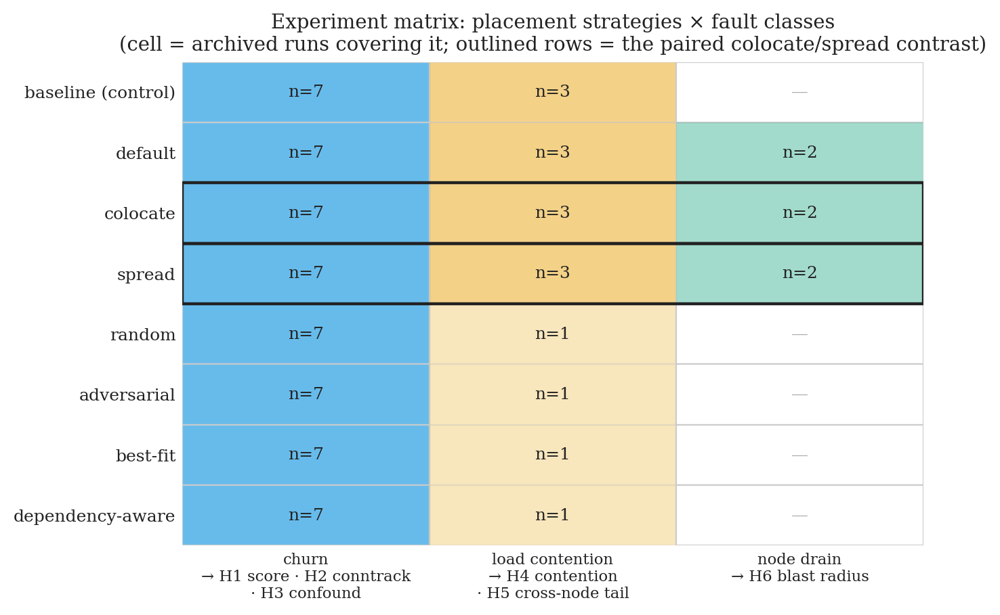
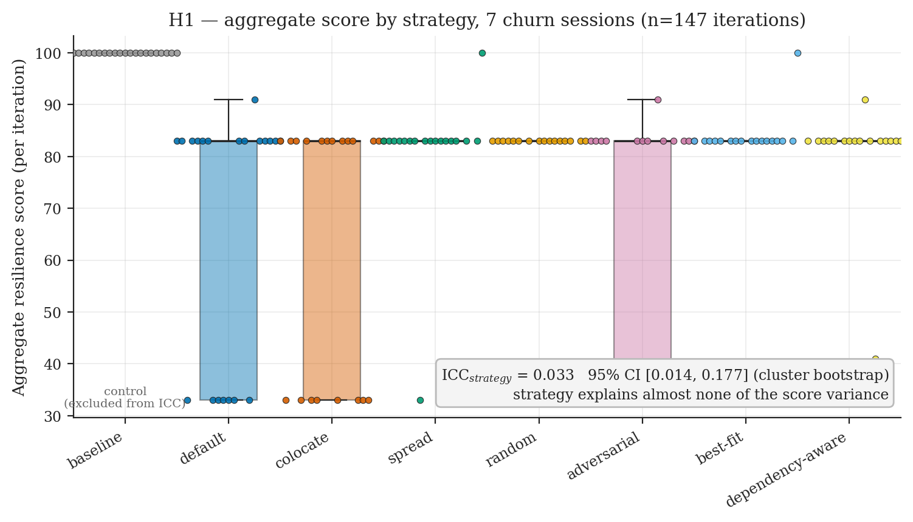
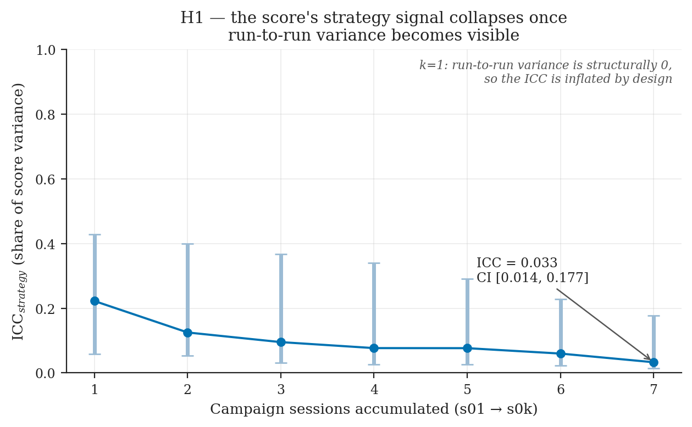
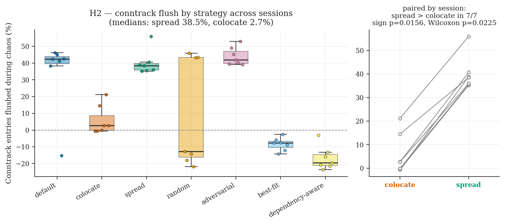
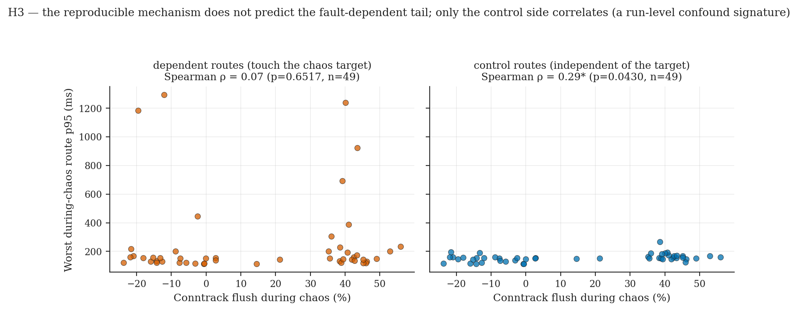
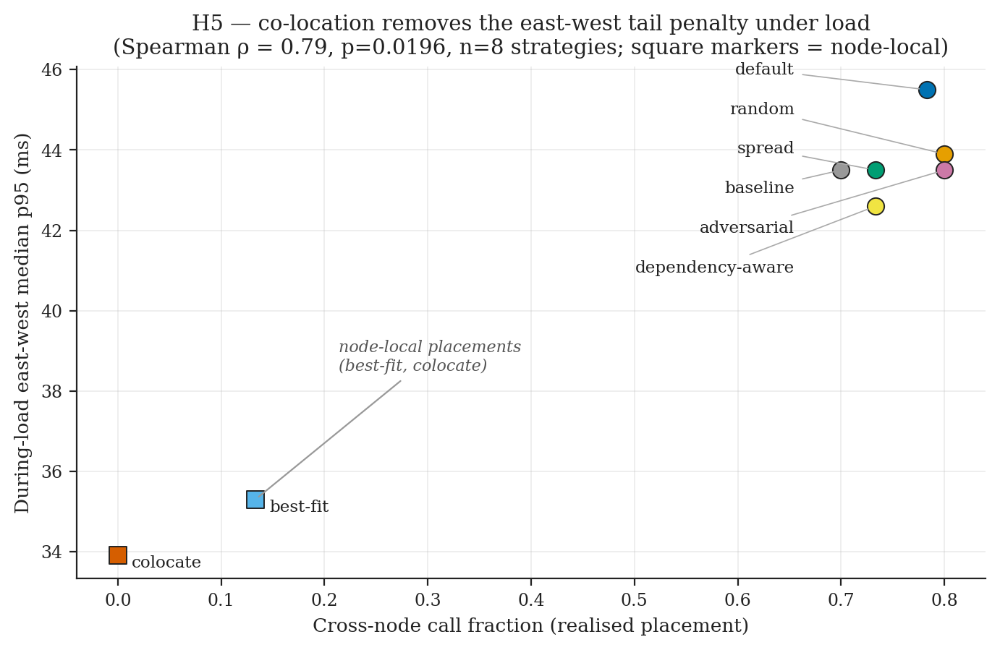
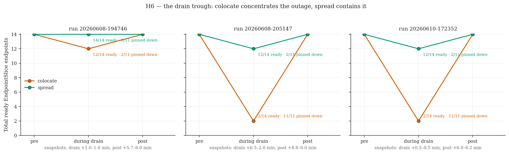
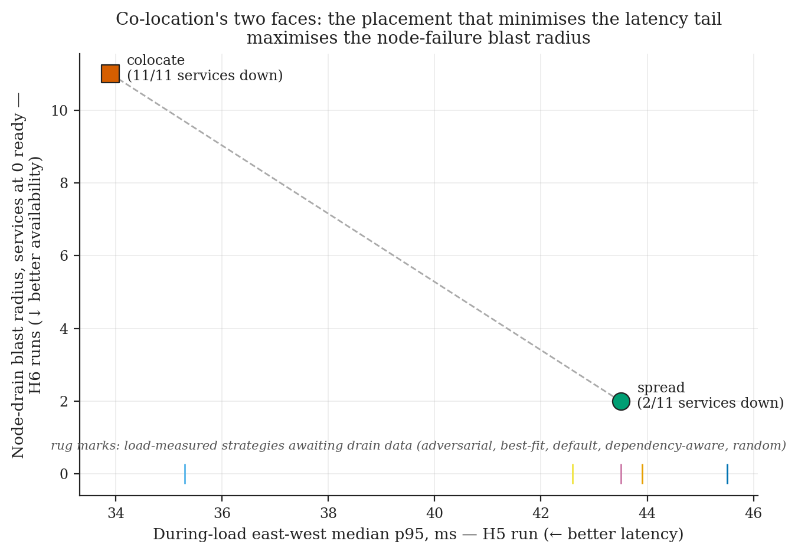

# 5. Results

<!-- Numbers in this chapter are FINAL (post-#245): the 7-session campaign
(s01–s07) is the primary H1–H3 evidence; the pooled pre-campaign run-set is
pilot-only. Every number traces to an archived run via Appendix A
(09-appendix-provenance.md). Wording per scope-of-claims.md. -->

Reading order: H1 establishes that the aggregate instrument is blind; H2–H4
show placement reproducibly moves mechanism layers that do not reach the
user; H5–H6 locate where placement does bite — node failure — as a measured
latency↔availability trade-off. The fault-class grouping is churn (H1–H3),
load (H4–H5), node failure (H6).

**Figure 5.1** — the fault-class × measurement-layer core matrix: which layer
moves under churn / load / node failure, and whether it reaches the user.

## 5.1 H1 — The aggregate score cannot rank placement strategies

**Statement.** The probe-based aggregate resilience score does not
reproducibly discriminate placement strategies; between-strategy differences
are a small fraction of total score variance and undetectable at feasible
iteration counts.

**Result — supported (7-session campaign, 147 churn iterations).**

| Quantity | Value |
|---|---|
| `ICC_strategy` | **0.033** (cluster-bootstrap 95% CI **[0.014, 0.178]**) |
| Variance partition | between-strategy **3.3%** / run-to-run **37.6%** / iteration **59.1%** |
| Focal contrast (colocate 64.0 vs spread 74.3) | *d* = 0.46 → **73 iterations/strategy** for 80% power |
| MDE at the *n* = 3 actually run per session | 2.29 sd ≈ **51 score points** — larger than any gap that exists |

The earlier pooled run-set (16 mixed-version runs: ICC 0.046, focal *d* = 0.06
needing ≈3,982/strategy) read the same way and is retained as the pilot only.

Scope (per §2.1): this is "cannot **rank placement strategies under session
variance**" — MicroRes's 0.86–0.90 *binary* classification accuracy is a
different task and is not contradicted.

**Figure 5.2** — per-strategy score distributions across the seven sessions
(overlapping spreads, means clustered 64–74). **Figure 5.3** — ICC trajectory
as sessions accumulate, 0.222 → 0.033 (run-to-run variance accrues with k).

## 5.2 H2 — Placement reproducibly moves a kernel/network reconvergence signature

**Statement.** Under churn, spreading the target's dependents across nodes
flushes a large fraction of per-node conntrack state during the kill cycle;
co-location does not.

**Result — supported (7/7 sessions).** Median conntrack flush: `spread`
**38.5%** vs `colocate` **2.7%**; `spread > colocate` in **7/7** independent
sessions — **sign test *p* = 0.0156, paired Wilcoxon W = 0, *p* = 0.0225**.
The pooled pilot agreed (36.6% vs 1.9%, 16/16 runs). This is the most
reproducible signal in the study.

Secondary, corroborating only: `colocate` throttles CPU lowest in 6/7
sessions (the pooled pilot had `best-fit` lower still) — lead with conntrack.

**Mechanism — protocol composition measured.** A dedicated probe (per-node
`conntrack -L` protocol counts at 5 s intervals through one full kill cycle
under each placement; §6.3, raw data + chaos-window timestamps in
`data/conntrack-probe/`) yields three window-robust composition findings:
(1) **TCP dominates the table under both placements and drops sharply at
the kill cycles in both** (spread 5,935 → 4,253, −28%; colocate
4,973 → 3,937, −21%) — kernel-side teardown of flows traversing the killed
pod: kube-proxy has no TCP conntrack-deletion path (#100698, #104098;
verified across the ≤v1.31 exec cleaner and ≥v1.32 netlink reconciler), and
close-state conntrack timeouts (10–120 s; §6.3) expire torn-down flows
within the cycle;
(2) **the clearly placement-dependent component is UDP (DNS)**: under
steady load `spread` sustains ~**4×** more UDP entries than `colocate`
(chaos-window medians 910 vs 224), consistent with cross-node calls driving
connection churn and DNS re-resolution, and with kube-proxy's documented
UDP-only cleanup (#48370, #108523, #126130; ipvs mode here) having more to
clean under spread; (3) with *i* = 1 and a Locust-ramp-contaminated
baseline, the probe **cannot apportion the campaign's flush percentages**
between the two paths — both mechanisms are visible; their shares remain
unquantified. The seven sessions carry the statistics; the probe carries
composition and event timing.

**Figure 5.4** — conntrack flush % per strategy across the seven sessions
(spread > colocate in all seven; note `default` flushes as hard as `spread`
(~42%) while `dependency-aware`/`best-fit` show *negative* flush — entries
grow during chaos — consistent with the flush tracking placement-dependent
state composition rather than a fixed per-strategy quantity).

## 5.3 H3 — The mechanism is decoupled from the user-visible outcome

**Statement.** The reproducible mechanism (H2) does not translate into a
reproducible user-visible outcome on the fault-dependent routes beyond a
run-level confound.

**Result — decoupling supported (campaign + three pilot tests).** Across the
7 sessions (49 strategy-cells): conntrack flush → **dependent**-route p95 is
**ρ = 0.07 (*p* = 0.65)** and **decoupled by TOST**, while the **control**
route shows ρ = 0.29 (*p* = 0.043) — the mechanism correlates with the route
that does *not* depend on the killed service: the signature of a run-level
confound, not propagation. The only dependent-significant association
(TCP-retransmit delta, ρ = −0.32) is *negative* — opposite a propagation
story. Pilot agreement: pooled ρ = 0.15 n.s.; the one significant mechanism
(CoreDNS p99) stronger on control (0.54) than dependent (0.31); within-run
mean ρ ≈ +0.10; robust to route reclassification.

No statistics needed for the headline table: `dependency-aware` has the
*worst* mechanism (conntrack +20%) and the *best* dependent-route error rate
(1.4%); `spread` flushes 9× more than `colocate` yet they tie on user-visible
error (8.0% vs 8.9%).

Why would a kernel-layer signature this reproducible fail to reach the user
routes? The plausible mechanism reading: under single-replica churn the
user-visible outcome is dominated by the outage itself — the target's only
replica is gone for the same deletion-to-ready cycle whatever the topology —
while client retries and timeouts mask the differences in reconvergence
timing that the conntrack signature represents. This interpretation is ours
(per the convention of Chapter 6); what is measured is the layer split, and
§6.1 develops the account in full.

**Figure 5.5** — mechanism-vs-outcome scatter (dependent vs control routes
per strategy-cell): the flush correlates with the route that does *not*
depend on the killed service.

## 5.4 H4 — Under load contention, placement moves the mechanism, not (reproducibly) the user

This section contains the first of two results the provenance discipline
retracted — the demonstration that the gate works as designed (§4.3).

**Result — mechanism replicates; user layer does not.** Two *i* = 4 batches
(the second with fully clean, doctor-gated provenance):

- *Replicated*: east-west inter-service p95, median spread/colocate ratio
  **1.39× (batch A)** and **1.36× (batch B)** — co-location keeps calls
  node-local.
- *Not replicated*: user-facing during-load ratios collapsed from ~2.1–2.4×
  (batch A, dependent > control) to ~1.05–1.40× (batch B, dependent ≈
  control — no dependency specificity). The dirty pilot's "co-location ~3×
  better at the user layer" reading did not survive replication.

**No user-visible placement effect is claimed under load.** The finding
matches the churn result: layered decoupling holds across both fault classes.

Why does the east-west effect replicate while the user routes do not? The
inter-service hop is the direct mechanical path placement changes — a call
either crosses a node boundary or it does not — whereas a user-facing route
aggregates many hops and, under a 200-user spike, sits behind cluster-wide
queueing noise that affects every route alike. The locality term plausibly
drowns in that first-order saturation before it reaches the front end. This
interpretation is ours (per the convention of Chapter 6); §6.2 prices the
east-west locality face that does replicate against its availability
counterpart.

## 5.5 H5 — A graph-derived metric separates node-local from spreading placements

This section contains the second result the provenance discipline retracted:
replication kept the separation but took back the headline correlation (§4.3).

**Result — the two-regime separation replicates across two independent
batches; a continuous law does not.** Across all 8 strategies under a
200-user spike (*i* = 4 per batch):

| strategy | frac (batch 1) | EW p95 (batch 1) | frac (batch 2) | EW p95 (batch 2) |
|---|---|---|---|---|
| **colocate** | 0.00 | **33.9** | 0.00 | **33.2** |
| **best-fit** | 0.13 | **35.3** | 0.00 | **35.7** |
| dependency-aware | 0.73 | 42.6 | 0.73 | 43.8 |
| spread | 0.73 | 43.5 | 0.73 | 44.2 |
| baseline | 0.70 | 43.5 | 0.78 | 41.7 |
| adversarial | 0.80 | 43.5 | 0.80 | 42.0 |
| default | 0.78 | 45.5 | 0.82 | 41.6 |
| random | 0.80 | 43.9 | 0.80 | 42.8 |

In **both** batches the two node-local placements (cross-node fraction ≈ 0)
occupy the two lowest east-west tails of eight — per-batch null probability
1/28 ≈ 0.036, jointly ≈ 0.0013 — at ~**1.25×** below the spreading cluster
(~34.6 vs ~43.5 ms medians in batch 1; ~34.5 vs ~42.4 ms in batch 2). The
fraction, computed pre-chaos from the dependency graph + actual
`podPlacements`, captures that separation.

The *continuous* correlation did **not** replicate: batch 1's Spearman
ρ = 0.79 (n = 8, carried by `best-fit`'s intermediate 0.13 point) collapsed
to **ρ = 0.25 (n.s.)** in batch 2, where `best-fit` packed fully (fraction
0.00) and the spreading cluster showed no internal trend. We therefore claim
H5 as a **replicated two-regime separator**, not a smooth predictor — and
quote ρ = 0.79 only alongside ρ = 0.25.

Secondary findings: locality is **not unique to `colocate`** (`best-fit`'s
bin-packing lands node-local in both batches — any node-packing placement
gets the benefit); **`dependency-aware` did not deliver** (fraction 0.73 in
both batches — the BFS partition did not co-locate communicating services as
intended; its tail ≈ spread's both times).

Caveats: the user layer stays weak (~1.3×, not dependency-specific); batch
2's launching tree was dirty in non-code files only (deck binary + figure
PNGs; running code = `e543fbb`); the aggregate score is **saturated** in
these load runs (batch 1: all eight strategies scored 100; CIs overlap in
both batches — H1 again, and the saturation §6.1 discusses); this is
**validation of a static separator**, not of the locality concept (§2.1).

**Figure 5.6** — cross-node fraction vs during-load east-west p95 (batch 1;
square markers = the node-local pair). Batch 2 reproduces the separation with
`best-fit` at fraction 0.00; see the table above.

## 5.6 H6 — Co-location is a latency/availability trade-off

**Result — supported and reproduced (two doctor-clean node-drain batches:
*i* = 1 and *i* = 3).** Draining the node hosting `productcatalogservice`:

| placement | services on drained node | blast radius (observed) | target recovery (mean) |
|---|---|---|---|
| **colocate** | 11 / 11 | **11 — whole app offline** | **≈ 10.3 s** |
| **spread** | 2 / 11 | **2 (18%)** | **≈ 2.6 s** |

Observed blast equals placement-predicted blast in every iteration, measured
from EndpointSlice outage troughs (15 s sampling) — not the score, which is
unusable here (a drain leaves every Litmus probe `Unknown`; H1 again).

**Gradient extension (6 placing strategies × *i* = 3, doctor-clean).**
The full gradient run confirms the relationship is exact across the
intermediate placements: **observed blast equals the placement-predicted
blast for every strategy** —

| strategy | services on drained node | blast (observed) | recovery (mean) |
|---|---|---|---|
| colocate | 11 | **11** | 10.8 s |
| random | 4 | **4** | 4.6 s |
| dependency-aware | 3 | **3** | 33.3 s |
| best-fit | 3 | **3** | 9.7 s |
| spread | 2 | **2** | 2.6 s |
| adversarial | 2 | **2** | 33.1 s |

Spearman(predicted, observed) = **1.0** (n = 6): per-node concentration
predicts the availability consequence exactly, the availability analogue of
H5's separator. **Recovery time, however, is *not* monotone in blast** —
intermediate-blast placements produced both the fastest (4.6 s) and slowest
(33.3 s) recoveries — so the recovery claim is scoped to the
colocate-vs-spread extremes contrast (10.3 s vs 2.6 s, ~4×), where it
reproduced across both original batches. (Recovery times are not pooled
across batches: the gradient run is a distinct batch and reads colocate at
10.8 s vs 10.3 s in the two-point batches.)

**The trade-off is the finding**: the same co-location that gives the lowest
east-west tail (H5: ~33–34 ms in both batches) gives a 100% single-drain
outage; `spread` is the mirror. One graph property, two opposing measured
consequences. Framing per scope-of-claims: this is the **quantification of a
known qualitative trade-off**, not its discovery (the full novelty framing
lives in §6.2) — the empirical content is that it materializes under real
chaos with no partial survival, holds across the full strategy gradient, and
drives a measured recovery penalty at the extremes.

Caveats: single-replica, single cluster; recovery non-monotonicity above.

**Figure 5.7** — EndpointSlice ready-count trajectory through the drain
(colocate vs spread; the i = 3 batch catches the trough that a fixed-offset
snapshot missed — the motivation for the 15 s trough sampler).

**Figure 5.8** — the headline figure: the same placements plotted on the
east-west latency axis (H5) and the node-drain blast-radius axis (H6),
opposing gradients of co-location.

## 5.7 Per-claim evidence table

| Claim | Data | Test | Figure | Archived run(s) (Appendix A) |
|---|---|---|---|---|
| H1: score cannot rank under session variance | s01–s07, 147 iterations | variance partition; ICC + cluster-bootstrap CI; power/MDE | 5.2, 5.3 | run-20260608-233543 … run-20260610-130249 (7 archives) |
| H2: conntrack flush, spread > colocate | s01–s07 | sign test (7/7, p = 0.0156); Wilcoxon (W = 0, p = 0.0225) | 5.4 | same 7 archives |
| H3: mechanism ⟂ dependent-route outcome | s01–s07, 49 cells | Spearman dep 0.07 vs ctrl 0.29*; TOST equivalence | 5.5 | same 7 archives |
| H4: east-west replicates, user layer does not | 2 × *i* = 4 load batches | ratio replication (1.36–1.39×); dep-vs-ctrl collapse | — | run-20260607-193053, run-20260607-221822 |
| H2 mechanism: UDP-pool decomposition | 2 × *i* = 1 probe runs + 5 s protocol samples | composition: UDP −50–58% vs TCP growth under spread | — | run-20260610-200013, run-20260610-201131; `data/conntrack-probe/` |
| H5: cross-node fraction separates node-local from spreading | 2 × (8 strategies × *i* = 4) | lowest-2-of-8 ranks in both batches (joint ≈ 0.0013); ρ = 0.79 → 0.25 | 5.6, 5.8 | run-20260608-070638, run-20260610-202426 |
| H6: blast radius + recovery trade-off | 2 node-drain batches + 6-strategy gradient | predicted = observed blast every iteration; gradient ρ = 1.0 (n = 6); recovery contrast at extremes | 5.7, 5.8 | run-20260608-194827, run-20260608-205229, run-20260610-172430 |

## 5.8 What the gate retracted

Two of this study's most striking numbers appear nowhere among its claims,
and that is a result in itself. The dirty H4 pilot read as "co-location ~3×
better at the user layer"; the clean, doctor-gated replication collapsed the
user-facing ratios to ~1.05–1.40× with no dependency specificity, and the
reading was retracted (§5.4). H5's batch-1 continuous correlation (Spearman
ρ = 0.79) collapsed to ρ = 0.25 n.s. in batch 2, and only the two-regime
separation is claimed (§5.5). In both cases the provenance-and-replication
gate (§4.3) did exactly what it was designed to do: it caught the most
quotable numbers in the study and removed them. A method that retracts its
own most striking results is the credibility argument for contribution 3 —
the campaign protocol's discipline is demonstrated here, not merely stated
(§7.3, §8.1).
